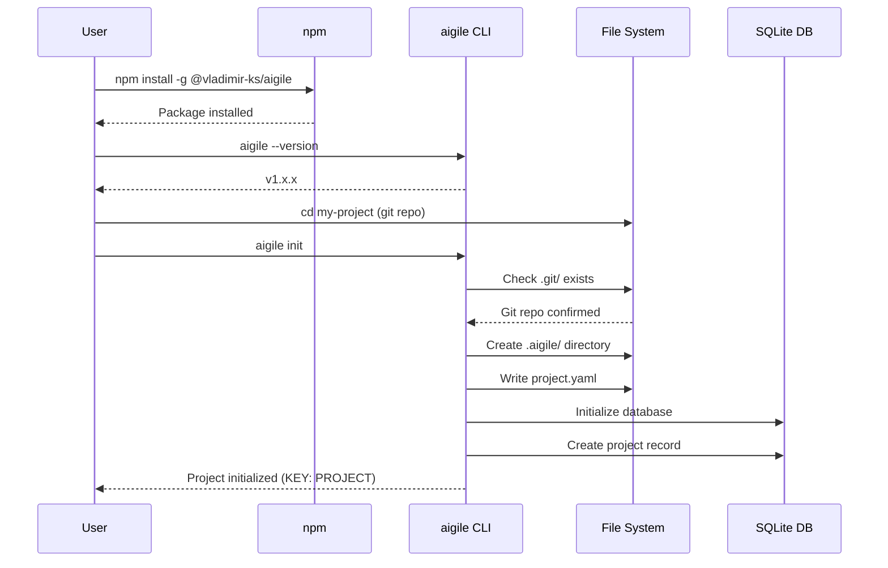

---
metadata:
  status: PRODUCTION
  version: 1.1
  tldr: "Installation and initialization journey - from npm install to first project"
  author: Vladimir K.S.
  audience: [Product Owner, AI Agent]
---

# Journey 01: Installation & Initialization

> **Note:** AIGILE is a hybrid methodology (waterfall + agile) optimized for AI agents. See [AIGILE Methodology](../AIGILE-METHODOLOGY.md) for key differences from classical Agile.

## Overview

Install AIGILE CLI and initialize your first project in under 2 minutes.

## Prerequisites

- Node.js 18+
- Git repository (initialized)
- Terminal access

---

## Sequence Diagram



---

## Step-by-Step

### Step 1: Install AIGILE

```
npm install -g @vladimir-ks/aigile
```

**Expected Output:**
```
added 1 package in 2s
```

### Step 2: Verify Installation

```
aigile --version
```

**Expected Output:**
```
1.x.x
```

### Step 3: Navigate to Project

```
cd /path/to/my-project
```

**Requirement:** Directory must be a git repository.

### Step 4: Initialize AIGILE

```
aigile init
```

**Expected Output:**
```
Initialized AIGILE project: my-project
Project key: MYPROJ
Created .aigile/project.yaml
```

### Step 5: Verify Initialization

```
ls -la .aigile/
```

**Expected Output:**
```
drwxr-xr-x  project.yaml
```

---

## Files Created

| File | Purpose |
|------|---------|
| `.aigile/project.yaml` | Project configuration |
| `~/.aigile/aigile.db` | SQLite database (global) |

---

## Project Configuration

`.aigile/project.yaml`:
```yaml
project:
  key: MYPROJ
  name: my-project
  description: ""
```

---

## Validation

```
aigile project show
```

**Expected Output:**
```
Project: my-project (MYPROJ)
Path: /path/to/my-project
Created: 2025-01-01T00:00:00Z
```

---

## Common Issues

| Issue | Solution |
|-------|----------|
| "Not a git repository" | Run `git init` first |
| "Permission denied" | Use `sudo npm install -g` or fix npm permissions |
| "Project already initialized" | `.aigile/` exists; remove to reinitialize |

---

## Next Journey

[Journey 02: Project Setup](./journey-02-project-setup.md) - Configure project and create first entities.
