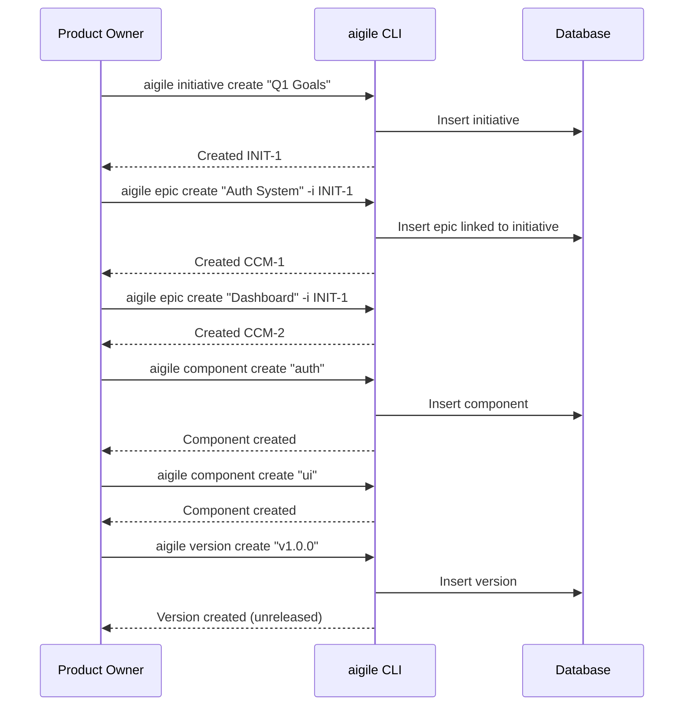
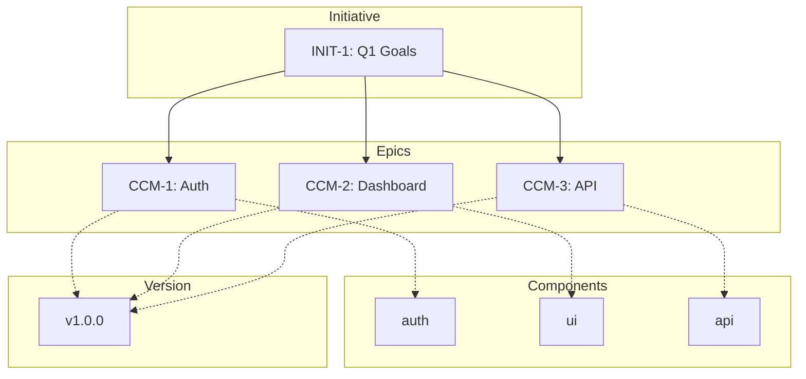

---
metadata:
  status: PRODUCTION
  version: 1.1
  tldr: "AIGILE project setup - capture full vision upfront before any sprints begin"
  author: Vladimir K.S.
  audience: [Product Owner, AI Agent]
---

# Journey 02: Project Setup (Vision Capture)

> **AIGILE Principle:** Capture the COMPLETE vision before any sprints. This is the waterfall phase of the hybrid methodology.

## Overview

Configure your project structure by creating initiatives, epics, stories, and components. **In AIGILE, all work items should be defined BEFORE the first sprint begins.**

## Prerequisites

- AIGILE initialized (Journey 01 complete)
- Complete understanding of project goals
- Architecture decisions made

---

## Sequence Diagram



---

## Step-by-Step

### Step 1: Create Initiative (Strategic Goal)

```
aigile initiative create "Q1 Platform Enhancement" --priority High
```

**Expected Output:**
```
Created initiative INIT-1: Q1 Platform Enhancement
```

### Step 2: Create Epics (Large Features)

```
aigile epic create "User Authentication" -i INIT-1 --priority High
aigile epic create "User Dashboard" -i INIT-1 --priority Medium
aigile epic create "API Integration" -i INIT-1 --priority Medium
```

**Expected Output:**
```
Created epic CCM-1: User Authentication
Created epic CCM-2: User Dashboard
Created epic CCM-3: API Integration
```

### Step 3: Create Components (Code Areas)

```
aigile component create "auth" -d "Authentication module" --lead "Dev Team"
aigile component create "ui" -d "User interface components"
aigile component create "api" -d "Backend API services"
```

### Step 4: Create Target Version

```
aigile version create "v1.0.0" -d "Initial release" --release 2025-03-01
```

### Step 5: Verify Setup

```
aigile query stats --json
```

**Expected Output:**
```json
{
  "success": true,
  "data": {
    "total": 4,
    "byType": {
      "initiative": 1,
      "epic": 3
    }
  }
}
```

---

## Entity Hierarchy Established

```
INIT-1: Q1 Platform Enhancement
  ├── CCM-1: User Authentication
  ├── CCM-2: User Dashboard
  └── CCM-3: API Integration

Components: auth, ui, api
Target Version: v1.0.0
```

---

## Project Structure Diagram



---

## Validation Checklist

- [ ] Initiative created and active
- [ ] Epics linked to initiative
- [ ] Components defined for code areas
- [ ] Target version created

---

## JSON Output Examples

**List Initiatives:**
```
aigile initiative list --json
```

**List Epics:**
```
aigile epic list --json
```

**List Components:**
```
aigile component list --json
```

---

## Next Journey

[Journey 03: Sprint Planning](./journey-03-sprint-planning.md) - Plan and start your first sprint.
