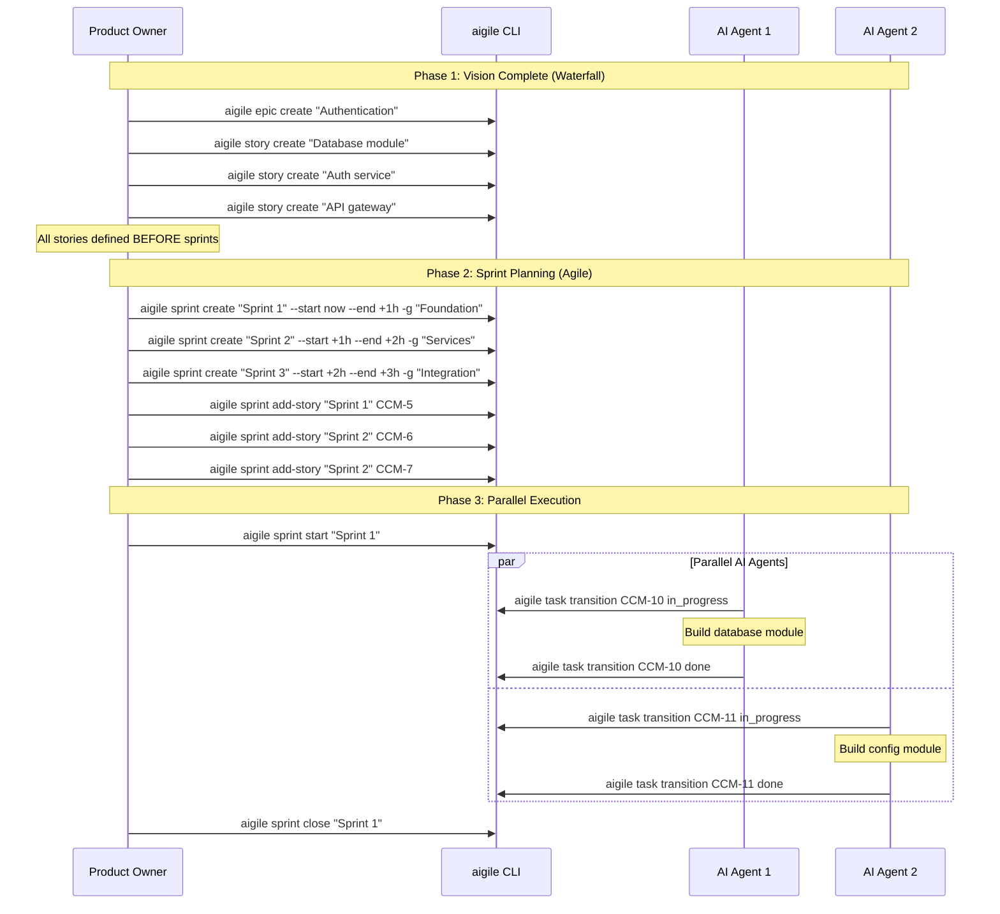
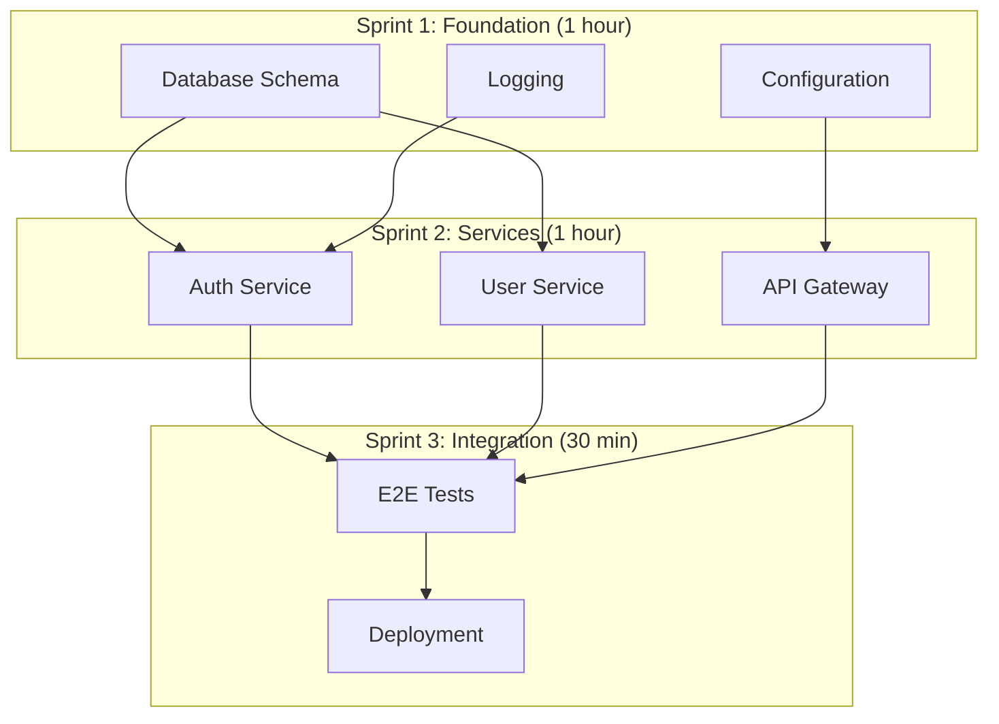

---
metadata:
  status: PRODUCTION
  version: 1.1
  tldr: "AIGILE sprint planning - hour-long sprints, module-first build, parallel AI agent execution"
  author: Vladimir K.S.
  audience: [Product Owner, AI Agent]
---

# Journey 03: Sprint Planning (AIGILE)

> **AIGILE sprints are hours, not weeks.** This journey reflects the AIGILE hybrid methodology where full vision is captured upfront and AI agents build modules in parallel.

## Overview

Plan sprints for module-by-module execution. Unlike classical Agile, AIGILE sprints are 1-2 hours long and focus on building specific modules/components rather than delivering MVP features.

## Prerequisites

- Vision capture complete (Journey 02)
- All epics and stories defined upfront
- Architecture designed
- Module dependencies mapped

---

## AIGILE vs Classical Sprint Planning

| Aspect | Classical Agile | AIGILE |
|--------|-----------------|--------|
| Duration | 2 weeks | 1-2 hours |
| Deliverable | Working MVP | Module/component |
| Estimation | Story points | N/A (AI executes) |
| Team | Human developers | AI agents in parallel |
| Build Order | Feature-by-feature | Foundation-up modules |

---

## Sequence Diagram



---

## Step-by-Step

### Phase 1: Define All Work Upfront

**AIGILE requires complete vision before sprints.** Create all epics, stories, and tasks first.

```
# Create module stories (no story points needed)
aigile story create "Database schema and migrations" -e CCM-1
aigile story create "Auth service implementation" -e CCM-1
aigile story create "User service implementation" -e CCM-1
aigile story create "API gateway setup" -e CCM-1
aigile story create "Integration tests" -e CCM-1
```

**Note:** Story points are optional in AIGILE. AI agents execute without estimation.

### Phase 2: Map Module Dependencies

Determine build order based on dependencies:

```
Foundation (Sprint 1):
  - Database schema
  - Configuration
  - Logging

Core Services (Sprint 2):
  - Auth service (depends on Database)
  - User service (depends on Database)
  - API gateway (depends on Config)

Integration (Sprint 3):
  - E2E tests
  - Integration verification
```

### Phase 3: Create Hour-Long Sprints

```
# Foundation sprint (1 hour)
aigile sprint create "Sprint 1: Foundation" --start now --end +1h -g "Core infrastructure"

# Services sprint (1 hour)
aigile sprint create "Sprint 2: Services" --start +1h --end +2h -g "Core services"

# Integration sprint (30 minutes)
aigile sprint create "Sprint 3: Integration" --start +2h --end +2.5h -g "E2E testing"
```

### Phase 4: Assign Stories to Sprints

```
# Foundation stories
aigile sprint add-story "Sprint 1" CCM-5   # Database
aigile sprint add-story "Sprint 1" CCM-8   # Config
aigile sprint add-story "Sprint 1" CCM-9   # Logging

# Service stories
aigile sprint add-story "Sprint 2" CCM-6   # Auth
aigile sprint add-story "Sprint 2" CCM-7   # User
aigile sprint add-story "Sprint 2" CCM-10  # API

# Integration
aigile sprint add-story "Sprint 3" CCM-11  # E2E tests
```

### Phase 5: Start Sprint with Parallel Agents

```
aigile sprint start "Sprint 1"
```

Multiple AI agents can work simultaneously on independent modules:

```
# Agent 1: Database module
aigile ai begin
aigile task transition CCM-15 in_progress
# ... implement ...
aigile task transition CCM-15 done
aigile ai end -s "Database module complete"

# Agent 2 (parallel): Config module
aigile ai begin
aigile task transition CCM-16 in_progress
# ... implement ...
aigile task transition CCM-16 done
aigile ai end -s "Config module complete"
```

---

## Module Build Order



---

## Sprint Types

| Type | Duration | Purpose | Deliverable |
|------|----------|---------|-------------|
| Foundation | 1-2 hours | Core infrastructure | DB, config, logging |
| Module | 30min-1hr | Individual service | Auth, API, etc. |
| Integration | 30min-1hr | Combine modules | Integrated system |
| Testing | 30min | E2E validation | Passing test suite |
| Fix | 15-30min | Address issues | Bug fixes |

---

## Parallel Agent Execution

```mermaid
gantt
    title Sprint 1: Foundation (Parallel Agents)
    dateFormat HH:mm
    axisFormat %H:%M

    section Agent 1
    Database Module: a1, 00:00, 40m
    section Agent 2
    Config Module: a2, 00:00, 30m
    section Agent 3
    Logging Module: a3, 00:00, 25m
```



---

## Validation Checklist

- [ ] All stories defined BEFORE sprints (vision complete)
- [ ] Module dependencies mapped
- [ ] Sprints created with hour durations
- [ ] Stories assigned to sprints by dependency order
- [ ] Foundation modules in first sprint
- [ ] Integration sprint planned last

---

## JSON Examples

**Create sprint:**
```
aigile sprint create "Sprint 1: Foundation" --start now --end +1h --json
```

**View sprint:**
```json
{
  "success": true,
  "sprint": "Sprint 1: Foundation",
  "data": [
    {"key": "CCM-5", "summary": "Database schema", "status": "backlog"},
    {"key": "CCM-8", "summary": "Configuration", "status": "backlog"},
    {"key": "CCM-9", "summary": "Logging", "status": "backlog"}
  ]
}
```

---

## Cross-References

- [AIGILE Methodology](../AIGILE-METHODOLOGY.md) - Understanding AIGILE vs Agile
- [Journey 04: AI Workflow](./journey-04-ai-daily-workflow.md) - Agent execution
- [Journey 06: Release](./journey-06-release-management.md) - Integration and release
