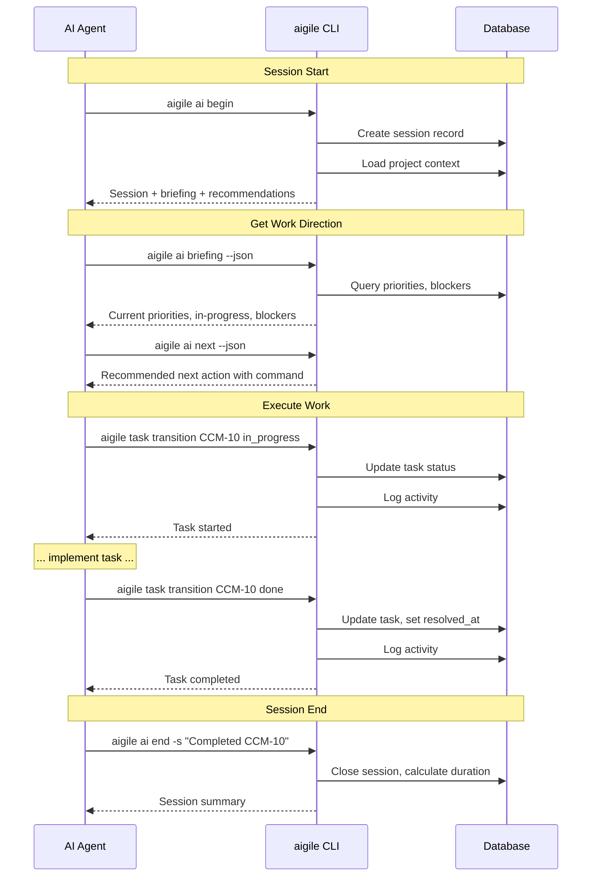
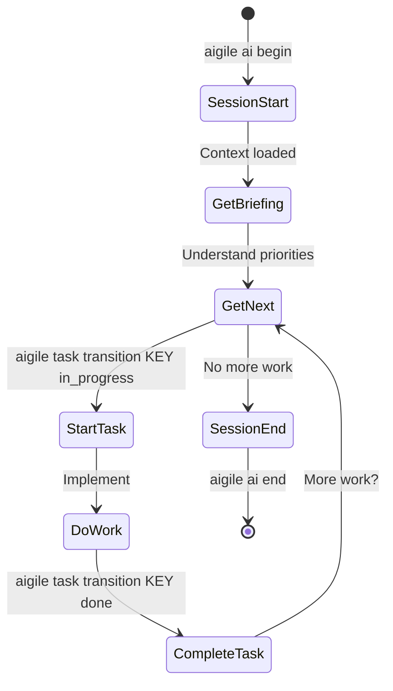
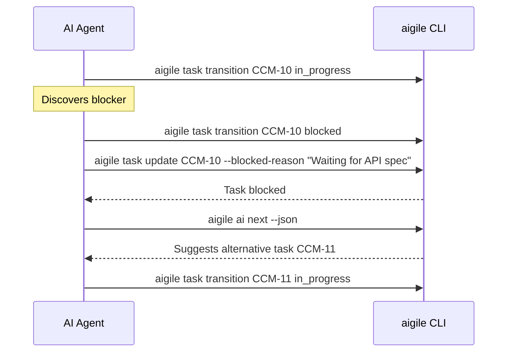

---
metadata:
  status: PRODUCTION
  version: 1.1
  tldr: "AI agent workflow - hour-long sessions, parallel execution, module-first development"
  author: Vladimir K.S.
  audience: [AI Agent]
---

# Journey 04: AI Agent Workflow

> **AIGILE sessions are hours, not days.** AI agents work in parallel on independent modules within hour-long sprints.

## Overview

Optimal workflow for AI agents to execute module development. Sessions are measured in hours (or less), and multiple agents can work simultaneously on independent modules.

**Key differences from classical "daily" workflow:**
- Sessions last hours, not a full workday
- Multiple AI agents work in parallel
- `aigile ai briefing` replaces standup meetings
- Module-first, not feature-first execution

## Prerequisites

- Active sprint with stories (Journey 03 complete)
- Module dependencies mapped
- Clear specifications for each module

---

## Sequence Diagram



---

## Step-by-Step

### Step 1: Start Session

```
aigile ai begin
```

**Response includes:**
- Session ID
- Project briefing
- Recommended first action

**JSON Output:**
```json
{
  "success": true,
  "data": {
    "session": {
      "id": "abc123...",
      "startedAt": "2025-01-02T09:00:00Z"
    },
    "briefing": {
      "project": {"key": "CCM", "name": "Project"},
      "overview": {"totalItems": 42, "inProgress": 2, "blocked": 0}
    },
    "nextSteps": {
      "recommendations": [
        {
          "action": "Start",
          "target": "CCM-10",
          "reason": "Highest priority task",
          "command": "aigile task transition CCM-10 in_progress"
        }
      ]
    }
  }
}
```

### Step 2: Get Briefing

```
aigile ai briefing --json
```

Review:
- Current sprint progress
- Items in progress
- Blocked items
- Pending comments

### Step 3: Get Next Recommendation

```
aigile ai next --json
```

Returns specific action with command to execute.

### Step 4: Start Work on Task

```
aigile task transition CCM-10 in_progress
```

### Step 5: Execute Implementation

Perform the actual development work.

### Step 6: Complete Task

```
aigile task transition CCM-10 in_review
aigile task transition CCM-10 done
```

### Step 7: Check for More Work

```
aigile ai next --json
```

Repeat steps 4-7 until session complete.

### Step 8: End Session

```
aigile ai end -s "Completed CCM-10, CCM-11. Started CCM-12."
```

---

## Daily Workflow Diagram



---

## Context Loading Strategy

| Situation | Command | Level |
|-----------|---------|-------|
| Start of day | `aigile ai begin` | standard |
| Quick status | `aigile context quick` | minimal |
| Deep analysis | `aigile context load --level full` | full |
| Specific entity | `aigile context entity story CCM-4` | focused |
| Resume work | `aigile ai resume` | resume |

---

## Handling Blockers



---

## Activity Tracking

All transitions are logged:

```
aigile session activity --json
```

```json
{
  "success": true,
  "data": [
    {"action": "transition", "entity": "CCM-10", "from": "todo", "to": "in_progress", "timestamp": "..."},
    {"action": "transition", "entity": "CCM-10", "from": "in_progress", "to": "done", "timestamp": "..."}
  ]
}
```

---

## Session Summary

At session end, receive:

```json
{
  "success": true,
  "data": {
    "session": {
      "id": "abc123...",
      "duration": "2h 15m",
      "entitiesModified": 3
    },
    "resumeContext": {
      "pendingWork": {
        "inProgressCount": 1,
        "blockedCount": 0
      }
    }
  }
}
```

---

## Best Practices for AI Agents

1. **Always start session** - Ensures activity tracking
2. **Use JSON output** - Machine-readable for parsing
3. **Follow recommendations** - `aigile ai next` optimizes priority
4. **Log blockers immediately** - Visibility for team
5. **Summarize at end** - Context for next session

---

## Validation Checklist

- [ ] Session started with `aigile ai begin`
- [ ] Briefing reviewed for priorities
- [ ] Tasks transitioned through workflow correctly
- [ ] Blockers logged with reasons
- [ ] Session ended with summary

---

## Next Journey

[Journey 05: Bug Triage](./journey-05-bug-triage.md) - Bug tracking and resolution workflow.
