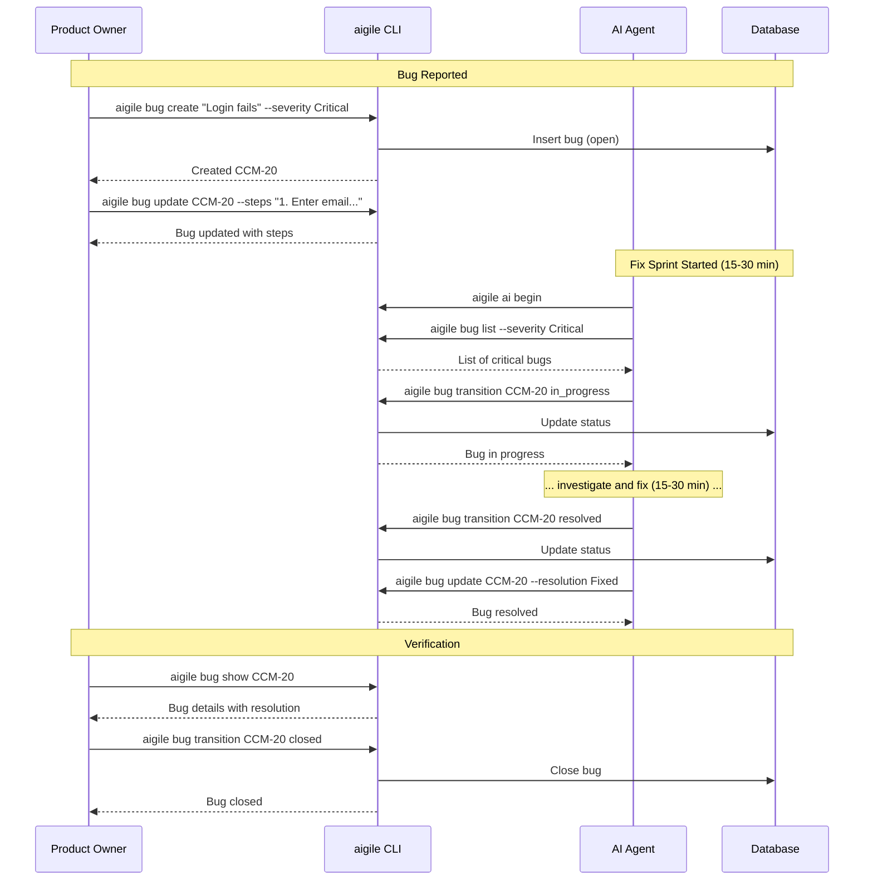
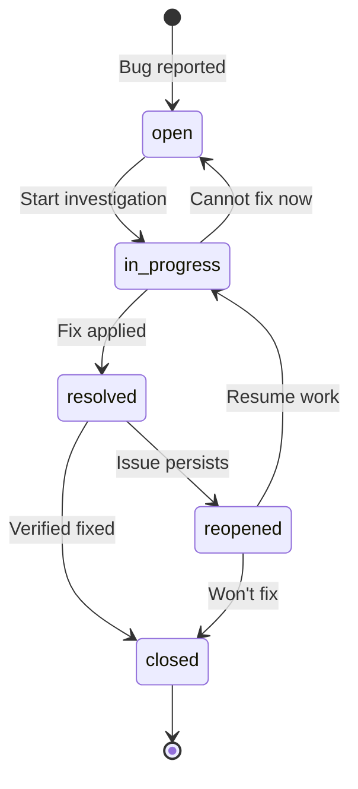

---
metadata:
  status: PRODUCTION
  version: 1.1
  tldr: "AIGILE bug triage - fix sprints (15-30 min), immediate AI agent response"
  author: Vladimir K.S.
  audience: [Product Owner, AI Agent]
---

# Journey 05: Bug Triage (AIGILE)

> **AIGILE Fix Sprints: 15-30 minutes.** Bugs are addressed immediately by AI agents in dedicated micro-sprints, not queued for future sprints.

## Overview

Complete bug lifecycle from initial report through investigation, fix, and verification. In AIGILE, critical bugs trigger immediate Fix Sprints.

## Prerequisites

- Project initialized
- AI agents available for Fix Sprints

---

## Sequence Diagram



---

## Step-by-Step

### Phase 1: Bug Report

#### Create Bug

```
aigile bug create "Login fails with valid credentials" --severity Critical -p High
```

#### Add Reproduction Details

```
aigile bug update CCM-20 \
  --steps "1. Navigate to /login\n2. Enter valid email\n3. Enter correct password\n4. Click Submit" \
  --expected "User is logged in and redirected to dashboard" \
  --actual "Error message: 'Authentication failed' appears"
```

#### Associate with Story/Epic

```
aigile bug update CCM-20 --story CCM-4 --epic CCM-1
```

### Phase 2: Triage

#### List by Severity

```
aigile bug list --severity Critical --json
aigile bug list --severity Blocker --json
```

#### Assign Developer

```
aigile bug update CCM-20 --assignee "Developer Name"
```

### Phase 3: Investigation

#### Start Work

```
aigile bug transition CCM-20 in_progress
```

#### Link to Component

```
aigile bug update CCM-20 --component auth
```

### Phase 4: Resolution

#### Mark Resolved

```
aigile bug transition CCM-20 resolved
aigile bug update CCM-20 --resolution Fixed
```

**Resolution Options:**
- Fixed
- Won't Fix
- Duplicate
- Cannot Reproduce
- Done

### Phase 5: Verification & Closure

#### Verify Fix

```
aigile bug show CCM-20
```

#### Close Bug

```
aigile bug transition CCM-20 closed
```

Or if issue persists:

```
aigile bug transition CCM-20 reopened
aigile bug transition CCM-20 in_progress
```

---

## Bug Workflow States



---

## AIGILE Severity Response

| Severity | Description | AIGILE Response |
|----------|-------------|-----------------|
| Blocker | System unusable | Immediate Fix Sprint (15 min) |
| Critical | Major feature broken | Fix Sprint within 1 hour |
| Major | Feature partially broken | Next available Fix Sprint |
| Minor | Cosmetic or minor issue | Batch into Module Sprint |
| Trivial | Enhancement suggestion | Backlog for future sprint |

**Key AIGILE Difference:** No waiting for "next sprint" - AI agents start Fix Sprints immediately.

---

## Bug Triage Dashboard

```
aigile bug list --json
```

```json
{
  "success": true,
  "data": [
    {
      "key": "CCM-20",
      "summary": "Login fails",
      "status": "open",
      "severity": "Critical",
      "priority": "High",
      "assignee": null
    }
  ]
}
```

---

## Filter Commands

| Filter | Command |
|--------|---------|
| Open bugs | `aigile bug list -s open` |
| My bugs | `aigile bug list --assignee "Name"` |
| Critical | `aigile bug list --severity Critical` |
| By story | `aigile query related story CCM-4` |

---

## Validation Checklist

- [ ] Bug created with severity and priority
- [ ] Steps to reproduce documented
- [ ] Expected vs actual behavior noted
- [ ] Bug assigned to developer
- [ ] Investigation started (in_progress)
- [ ] Resolution set when fixed
- [ ] Verification completed
- [ ] Bug closed

---

## JSON Examples

**Create Bug:**
```
aigile bug create "Issue title" --severity Major --json
```

**Bug Details:**
```
aigile bug show CCM-20 --json
```

```json
{
  "success": true,
  "data": {
    "key": "CCM-20",
    "summary": "Login fails with valid credentials",
    "status": "resolved",
    "severity": "Critical",
    "priority": "High",
    "resolution": "Fixed",
    "steps_to_reproduce": "1. Navigate to /login...",
    "expected_behavior": "User logged in",
    "actual_behavior": "Error message appears"
  }
}
```

---

## Next Journey

[Journey 06: Release Management](./journey-06-release-management.md) - Version releases and deployment.
