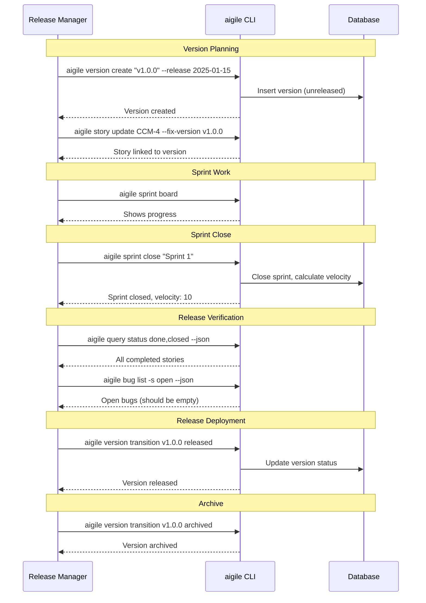
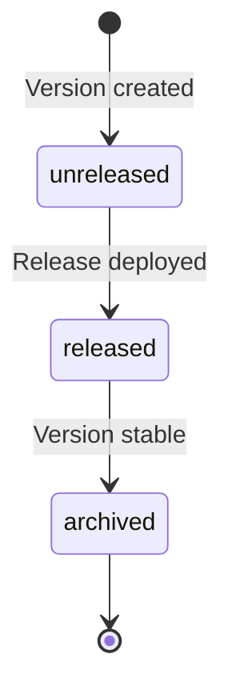
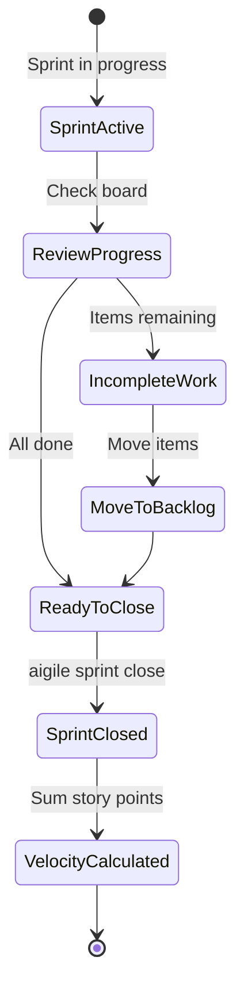

---
metadata:
  status: PRODUCTION
  version: 1.1
  tldr: "AIGILE release - Integration Sprint (30min-1hr), module verification, rapid deployment"
  author: Vladimir K.S.
  audience: [Product Owner, AI Agent]
---

# Journey 06: Release Management (AIGILE)

> **AIGILE Integration Sprint: 30min - 1 hour.** After module sprints complete, run integration verification before release. No lengthy release cycles.

## Overview

Manage releases from version planning through module completion to deployment. In AIGILE, releases happen after Integration Sprints verify all modules work together.

## Prerequisites

- Module sprints completed
- Version created (Journey 02)
- All modules passing tests

---

## Sequence Diagram



---

## Step-by-Step

### Phase 1: Version Planning

#### Create Version

```
aigile version create "v1.0.0" -d "Initial release with authentication" --release 2025-01-15
```

#### Link Stories to Version

```
aigile story update CCM-4 --fix-version v1.0.0
aigile story update CCM-5 --fix-version v1.0.0
```

#### View Version

```
aigile version show v1.0.0 --json
```

### Phase 2: Module Sprint Execution

#### Monitor Progress

```
aigile sprint board
aigile status
```

**AIGILE Note:** Multiple AI agents work in parallel on independent modules. Track via sprint board.

### Phase 3: Integration Sprint (30min - 1hr)

Before release, run an Integration Sprint to verify modules work together:

```
aigile sprint create "Integration Sprint" --start now --end +1h -g "E2E verification"
aigile sprint start "Integration Sprint"
```

#### AI Agent Executes Integration Tests

```
aigile ai begin
aigile task transition CCM-30 in_progress  # Integration test task
# ... run E2E tests, verify module connections ...
aigile task transition CCM-30 done
aigile ai end -s "Integration verified"
```

#### Close Integration Sprint

```
aigile sprint close "Integration Sprint"
```

**AIGILE Note:** Velocity tracking is optional - AI agents execute without estimation.

### Phase 4: Release Verification

#### Check Story Completion

```
aigile query search --status done,closed --json
```

#### Verify No Open Bugs

```
aigile bug list -s open
```

Should return empty list for release-blocking bugs.

#### Check Incomplete Stories

```
aigile query search --status backlog,in_progress,in_review --json
```

### Phase 5: Release Deployment

#### Release Version

```
aigile version transition v1.0.0 released
```

#### Verify Release

```
aigile version show v1.0.0
```

### Phase 6: Post-Release

#### Archive Version

After release is stable:

```
aigile version transition v1.0.0 archived
```

#### Plan Next Version

```
aigile version create "v1.1.0" --release 2025-02-15
```

---

## Release Workflow States



---

## Sprint Closure Diagram



---

## Release Checklist

### Pre-Release
- [ ] All sprint stories completed
- [ ] No blocking bugs open
- [ ] Stories linked to version
- [ ] Sprint closed with velocity

### Release
- [ ] Version transitioned to released
- [ ] Deployment completed
- [ ] Stakeholders notified

### Post-Release
- [ ] Monitor for issues
- [ ] Archive version when stable
- [ ] Plan next iteration

---

## AIGILE Sprint Types Summary

| Sprint Type | Duration | Purpose |
|-------------|----------|---------|
| Foundation | 1-2 hours | Core infrastructure |
| Module | 30min-1hr | Individual service/component |
| Integration | 30min-1hr | E2E verification |
| Fix | 15-30min | Bug resolution |

**AIGILE Note:** Velocity tracking exists but is optional - AI agents execute based on module specifications, not story point estimation.

---

## JSON Examples

**Version List:**
```
aigile version list --json
```

**Release Version:**
```
aigile version transition v1.0.0 released --json
```

---

## Next Journey

[Journey 07: Context Continuity](./journey-07-context-continuity.md) - Resume work across sessions.
