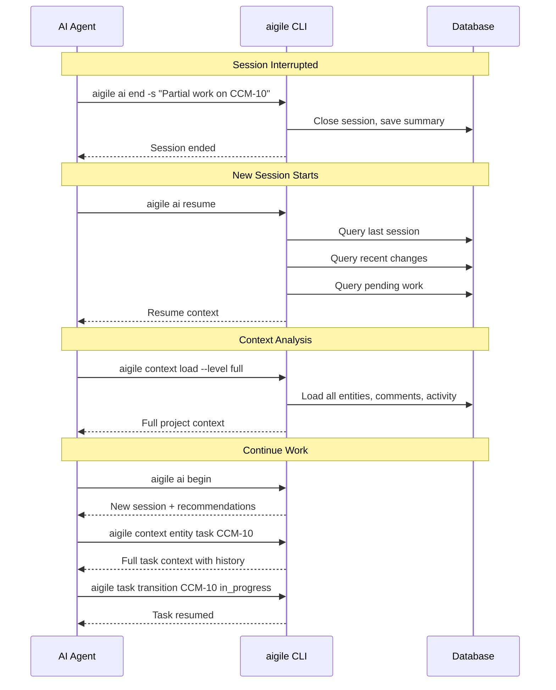
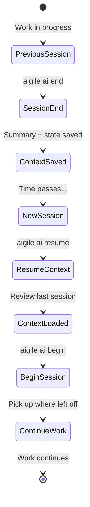
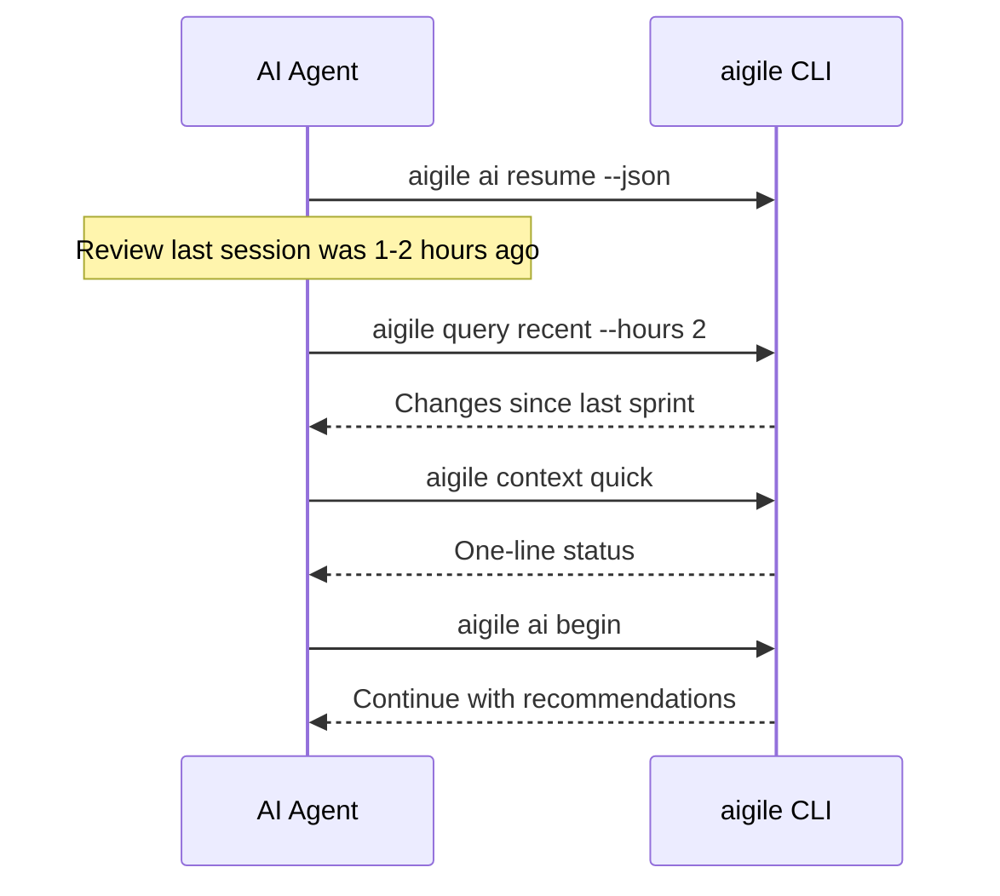
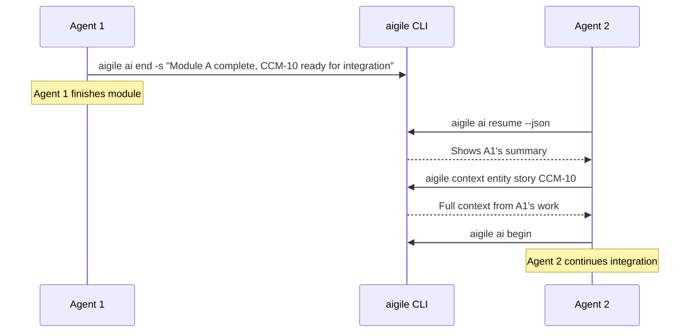

---
metadata:
  status: PRODUCTION
  version: 1.1
  tldr: "AIGILE context continuity - hour-long sessions, parallel agent handoffs, rapid resume"
  author: Vladimir K.S.
  audience: [AI Agent]
---

# Journey 07: Context Continuity (AIGILE)

> **AIGILE sessions are hours, not days.** Context handoffs happen frequently between parallel agents and across short sprints.

## Overview

Resume work seamlessly across AI sessions with full context restoration. In AIGILE, multiple agents may be working in parallel, and handoffs happen frequently within hour-long sprints.

## Prerequisites

- Previous session completed (typically 30min - 2 hours ago)
- Work items in various states
- Awareness of parallel agent activity

---

## Sequence Diagram



---

## Step-by-Step

### Step 1: Review Resume Context

```
aigile ai resume --json
```

**Response:**
```json
{
  "success": true,
  "data": {
    "lastSession": {
      "endedAt": "2025-01-02T17:30:00Z",
      "summary": "Completed CCM-9, partial work on CCM-10",
      "entitiesModified": 3
    },
    "recentChanges": [
      {"action": "transition", "entityType": "task", "entityKey": "CCM-9", "to": "done"},
      {"action": "transition", "entityType": "task", "entityKey": "CCM-10", "to": "in_progress"}
    ],
    "pendingWork": {
      "inProgressCount": 1,
      "blockedCount": 0,
      "unresolvedComments": 2
    }
  }
}
```

### Step 2: Start New Session

```
aigile ai begin
```

Session starts with awareness of previous work.

### Step 3: Load Appropriate Context

**For continuing specific work:**
```
aigile context entity task CCM-10 --json
```

**For full project overview:**
```
aigile context load --level full --json
```

### Step 4: Review In-Progress Items

```
aigile query status in_progress --json
```

### Step 5: Continue Work

```
aigile task show CCM-10
# Review current state

aigile task transition CCM-10 in_review
# Continue from where left off
```

---

## Context Continuity Diagram



---

## Context Levels for Resume

| Situation | Command | Purpose |
|-----------|---------|---------|
| Quick check | `aigile ai resume` | Last session summary |
| Continue task | `aigile context entity task CCM-10` | Specific entity details |
| Review all | `aigile context load --level full` | Complete project state |
| Just status | `aigile context quick` | One-line summary |

---

## Resume Context Components

### Last Session Info
- End timestamp
- Session summary
- Entities modified

### Recent Changes
- Last 10 entity modifications
- Actions: create, update, transition

### Pending Work
- In-progress items count
- Blocked items count
- Unresolved comments

---

## Handling Gaps

### AIGILE: Typical Gap (Minutes to Hours)



### Parallel Agent Handoff

When taking over work from another agent:



### Interrupted Session

If previous session didn't end cleanly:

```
aigile session status
```

If active session exists:
```
aigile session end -s "Interrupted - resuming"
aigile ai begin
```

---

## Query Commands for Context

| Need | Command |
|------|---------|
| Recent activity | `aigile query recent --hours 24` |
| My work | `aigile query assignee "AI Agent"` |
| Blocked items | `aigile query status blocked` |
| Sprint progress | `aigile sprint board` |

---

## Session Activity Log

Review what happened in previous session:

```
aigile session list --limit 5 --json
```

```json
{
  "data": [
    {
      "id": "session-1",
      "started_at": "2025-01-02T09:00:00Z",
      "ended_at": "2025-01-02T12:30:00Z",
      "summary": "Completed CCM-8, CCM-9",
      "entities_modified": 5
    }
  ]
}
```

---

## Validation Checklist

- [ ] Resume context reviewed
- [ ] Last session summary understood
- [ ] Pending work identified
- [ ] In-progress items located
- [ ] New session started
- [ ] Work continued from correct point

---

## AIGILE Best Practices

1. **Always end sessions properly** - Use summary for next agent
2. **Review before starting** - `aigile ai resume` first
3. **Load appropriate context** - Don't load full unless needed
4. **Check for blockers** - Review blocked items before planning
5. **Check parallel agent activity** - Others may have completed related modules
6. **Keep sessions short** - Hour-long sprints, not day-long sessions
7. **Summarize for handoff** - Your summary enables parallel agent efficiency

---

## JSON Examples

**Complete Resume Flow:**

```
# 1. Check resume context
aigile ai resume --json

# 2. Start new session
aigile ai begin --json

# 3. Get recommendations
aigile ai next --json

# 4. Load entity context if needed
aigile context entity task CCM-10 --json
```

---

## Cross-References

- [AIGILE Methodology](../AIGILE-METHODOLOGY.md) - Understanding AIGILE vs Agile
- [AI Agent Guide](../AI-AGENT-GUIDE.md) - Complete AI workflow guide
- [Journey 04: AI Agent Workflow](./journey-04-ai-daily-workflow.md) - Session patterns
- [CLI Reference: Context](../CLI-REFERENCE.md#context-commands) - Context commands
