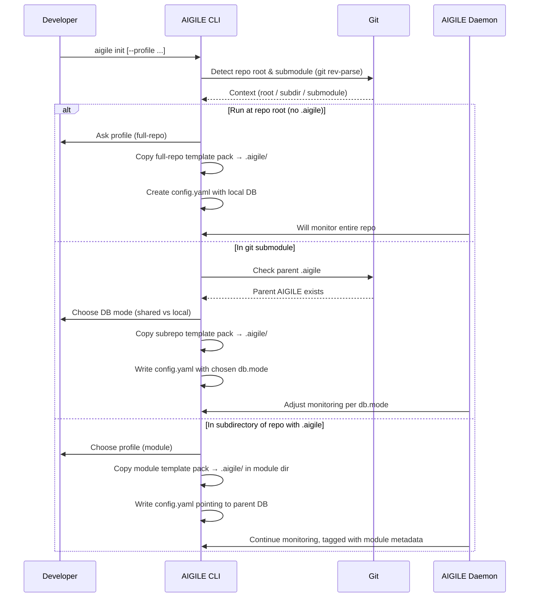

---
metadata:
  status: draft
  version: 0.1
  modules: [aigile, init]
  tldr: "User journey for initializing AIGILE in different git contexts and selecting the appropriate profile."
  dependencies: []
---

# Journey 08: AIGILE Init (Profiles & Contexts)

## 1. Context

This journey describes how a developer initializes AIGILE in a repository using the `aigile init` command.

Key concerns:

- Repositories may be:
  - A primary product repo.
  - A git submodule within a larger system.
  - A simple module/directory within an existing repo.
- We must decide:
  - Where the AIGILE database lives (local vs shared).
  - Which profile to use (`full-repo`, `subrepo`, `module`).
  - How to avoid overwriting existing docs or DBs.

The AIGILE CLI does not create documents ad hoc; it **copies template packs** and relies on **workplan configs** to guide filling in TEMPLATE docs.

---

## 2. Actors

- **Developer** – Runs `aigile init` in different folders.
- **AIGILE CLI** – Interprets git context, prompts for profile/DB mode, copies template packs.
- **AIGILE Daemon** – Monitors file changes and writes to the AIGILE DB.
- **Git** – Provides information about repo root and submodules.

---

## 3. High-Level Flow (Mermaid)



---

## 4. Branch A: Full-Repo Profile (Primary Product Repo)

### 4.1 Starting Point

- Developer is at `REPO_ROOT` of a product repository.
- No `.aigile/` exists yet.

### 4.2 Steps

1. Developer runs:

   ```bash
   aigile init --profile full-repo
   ```

2. CLI:
   - Confirms this is the repo root (not a submodule).
   - Verifies there is no existing `.aigile/`.

3. CLI copies the **full-repo template pack** into `REPO_ROOT/.aigile/`:
   - Creates business docs in `00_DOCS/`.
   - Creates spec skeletons in `01_SPECS/`.
   - Creates BDD structure in `02_FEATURES/`.
   - Creates testing infra skeleton in `03_TESTING_INFRA/`.

4. CLI writes `.aigile/config.yaml`:

   - `db.mode: local`
   - `db.path: .aigile/aigile.db`
   - `profile: full-repo`

5. AIGILE Daemon (when started) reads config and:
   - Monitors the entire repo (respecting `.gitignore` etc.).
   - Records file + frontmatter changes into `.aigile/aigile.db`.

6. A future `aigile next` command uses a **full-repo workplan config** to suggest the next TEMPLATE docs to fill (e.g. mission-vision → strategy → personas → finance).

---

## 5. Branch B: Subrepo Profile (Git Submodule)

### 5.1 Starting Point

- Developer is at `SUBMODULE_ROOT`.
- `git rev-parse --show-superproject-working-tree` is non-empty.
- Superproject may or may not have `.aigile/`.

### 5.2 Steps

1. Developer runs:

   ```bash
   cd submodules/premium-registry
   aigile init --profile subrepo
   ```

2. CLI:
   - Detects that this is a git submodule.
   - Checks whether the superproject has `.aigile/config.yaml`.

3. If superproject has AIGILE:
   - CLI asks:

     > “This is a git submodule. Parent repo has AIGILE.
     >  Do you want to:
     >  1) Share parent DB, or 2) Use a local DB?”

4. Based on choice:
   - **Shared DB**:
     - `.aigile/config.yaml` in subrepo points to parent DB:
       - `db.mode: shared`
       - `db.path: ../.aigile/aigile.db`
       - `profile: subrepo`
   - **Local DB**:
     - `.aigile/config.yaml` in subrepo points to its own DB:
       - `db.mode: local`
       - `db.path: .aigile/aigile.db`
       - `profile: subrepo`
     - Parent daemon is configured to exclude this path from monitoring.

5. CLI copies the **subrepo template pack** into `SUBMODULE_ROOT/.aigile/`:
   - Same hierarchical structure as `full-repo`.
   - Local PRD, epics, stories, specs, features, and testing infra for this bounded context.

6. Subrepo can now evolve mostly independently, while still optionally integrating with the parent AIGILE DB when `db.mode: shared`.

---

## 6. Branch C: Module Profile (Directory Inside Repo)

### 6.1 Starting Point

- Developer is in a **subdirectory** (e.g. `packages/aigile/`) of a repo that already has `.aigile/` at its root.
- This is NOT a git submodule.

### 6.2 Steps

1. Developer runs:

   ```bash
   cd packages/aigile
   aigile init --profile module --module-name aigile
   ```

2. CLI:
   - Confirms that repo root has `.aigile/config.yaml`.
   - Confirms this directory is **not** a git submodule.

3. CLI creates a **local module `.aigile`** in the current directory by copying the `module` template pack:

   ```text
   packages/aigile/.aigile/
     docs/
       01_module-overview.md
       02_mini-prd.md
     specs/
       01_spec-template.md
     features/
       01_happy-path.feature
       02_edge-cases.feature
   ```

4. CLI writes `packages/aigile/.aigile/config.yaml`:

   - `db.mode: shared`
   - `db.path: ../../.aigile/aigile.db`
   - `profile: module`
   - `module.name: aigile`
   - `module.path: packages/aigile`

5. Parent AIGILE Daemon:
   - Continues to monitor this directory.
   - Writes module-related docs/specs/features into the **shared DB**, tagged with `module` metadata.

6. A future `aigile next` can be run at the repo root or within the module:
   - At root: uses the repo-level workplan to show global next steps.
   - In module: uses a module-specific workplan (e.g. `.aigile/workplan.module.yaml`) to show the next few module docs to fill.

---

## 7. Safety & Idempotence (All Branches)

- **No overwrite:** `aigile init` MUST NOT overwrite existing files or DBs.
- **Additive only:** It creates missing files/directories from template packs but leaves existing content intact.
- **Existing `.aigile` at root:**
  - Running `full-repo` profile in a subdirectory MUST be rejected with a clear message suggesting `module` profile instead.
- **Template customization:**
  - Users MAY edit the template packs; `aigile init` MUST treat them as data.

---

## 8. Relationship to Specs

This journey is the UX-level description. The precise rules for:

- Profiles and DB modes.
- Template pack structures.
- Workplan config format and behavior.

are defined in:

- `.aigile/01_SPECS/aigile-init-spec.md`
- `ccm-claude-md-prefix/ccm10-AIGILE-system.md`


