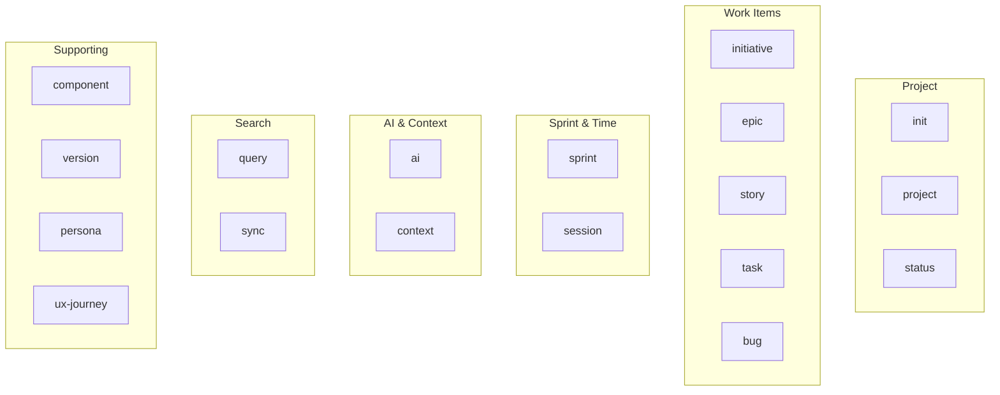
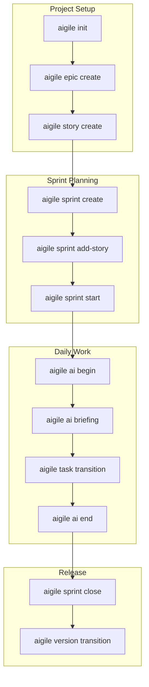
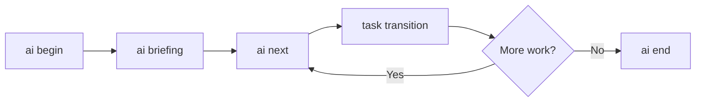

---
metadata:
  status: PRODUCTION
  version: 1.0
  tldr: "AIGILE command organization map - 18 commands grouped by function with subcommand reference"
  author: Vladimir K.S.
---

# Command Map

## Overview

AIGILE provides 18 top-level commands organized into functional groups.

---

## Command Groups Diagram



---

## Complete Command Reference

### Project Management

| Command | Subcommands | Purpose |
|---------|-------------|---------|
| `init` | - | Initialize project |
| `project` | list, show, set-default, remove | Manage projects |
| `status` | - | Project dashboard |

### Work Item Commands

| Command | Subcommands | Purpose |
|---------|-------------|---------|
| `initiative` | create, list, show, update, delete, transition | Strategic goals |
| `epic` | create, list, show, update, delete, transition | Large features |
| `story` | create, list, show, update, delete, transition | User stories |
| `task` | create, list, show, update, delete, transition | Implementation |
| `bug` | create, list, show, update, delete, transition | Defects |

### Sprint Management

| Command | Subcommands | Purpose |
|---------|-------------|---------|
| `sprint` | create, list, start, close, board, add-story | Sprint lifecycle |
| `session` | start, end, status, list, show, activity | Work sessions |

### AI & Context

| Command | Subcommands | Purpose |
|---------|-------------|---------|
| `ai` | begin, end, briefing, next, item, resume, status | AI workflow |
| `context` | load, quick, entity, resume | Context loading |

### Search & Query

| Command | Subcommands | Purpose |
|---------|-------------|---------|
| `query` | search, key, assignee, recent, status, related, stats | Search entities |
| `sync` | scan, status, list, comments | File sync |

### Supporting Entities

| Command | Subcommands | Purpose |
|---------|-------------|---------|
| `component` | create, list, show, update, delete | Code areas |
| `version` | create, list, show, update, delete, transition | Releases |
| `persona` | create, list, show, update, delete | User archetypes |
| `ux-journey` | create, list, show, update, delete | User flows |

---

## CRUD Operations Map

Standard CRUD operations across entities:

| Entity | Create | List | Show | Update | Delete | Transition |
|--------|--------|------|------|--------|--------|------------|
| Initiative | Y | Y | Y | Y | Y | Y |
| Epic | Y | Y | Y | Y | Y | Y |
| Story | Y | Y | Y | Y | Y | Y |
| Task | Y | Y | Y | Y | Y | Y |
| Bug | Y | Y | Y | Y | Y | Y |
| Sprint | Y | Y | - | - | - | start/close |
| Component | Y | Y | Y | Y | Y | - |
| Version | Y | Y | Y | Y | Y | Y |
| Persona | Y | Y | Y | Y | Y | - |
| UX Journey | Y | Y | Y | Y | Y | - |

---

## Workflow-Based Command Flow



---

## AI Agent Command Flow



---

## Query Command Options

| Subcommand | Filters Available |
|------------|-------------------|
| `search` | text, type, status, priority, assignee, epic, sprint, since, limit |
| `key` | pattern |
| `assignee` | name |
| `recent` | hours |
| `status` | status, type |
| `related` | type, key |
| `stats` | - |

---

## Common Command Patterns

### View Current State
```
aigile status              # Project dashboard
aigile sprint board        # Sprint board
aigile query stats         # Entity statistics
aigile ai status           # Session status
```

### Find Work
```
aigile query search "keyword"
aigile query assignee "Name"
aigile query status in_progress
aigile ai next
```

### Track Progress
```
aigile session activity
aigile query recent --hours 24
aigile sprint board
```

---

## JSON Output Support

All commands support `--json` flag:

```
aigile story list --json
aigile sprint board --json
aigile ai briefing --json
aigile query stats --json
```

---

## Command Aliases

| Command | Alias |
|---------|-------|
| `list` | `ls` |
| `delete` | `rm` |
| `query` | `q` |
| `query search` | `query s` |
| `ai briefing` | `ai b` |
| `ai next` | `ai n` |
| `ai status` | `ai s` |

---

## Cross-References

- [CLI Reference](../CLI-REFERENCE.md) - Full command documentation
- [Entity Hierarchy](./entity-hierarchy.md) - Entity relationships
- [AI Agent Guide](../AI-AGENT-GUIDE.md) - AI workflow commands
