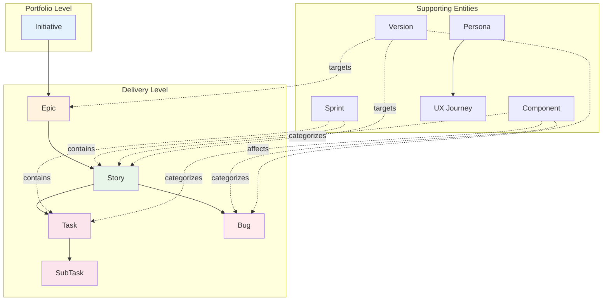
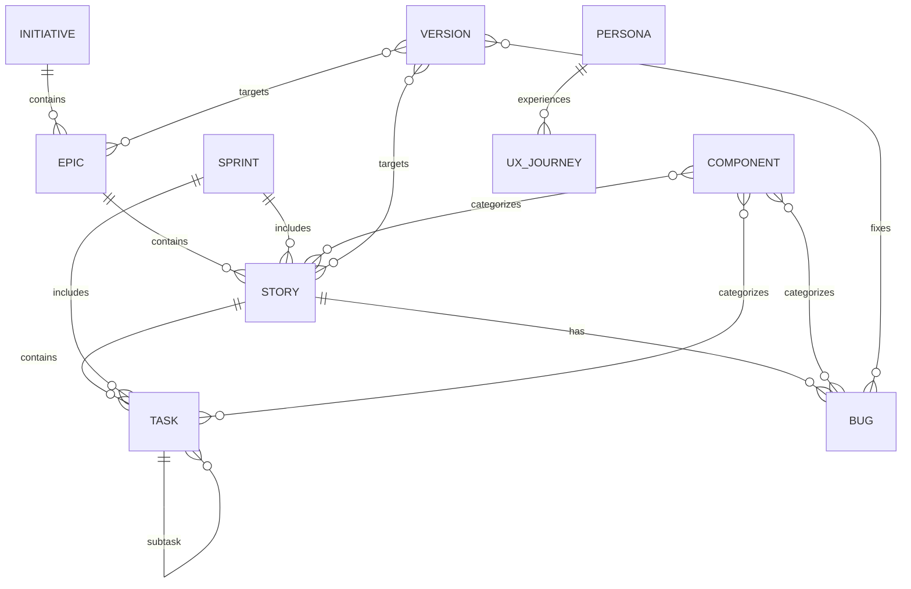

---
metadata:
  status: PRODUCTION
  version: 1.0
  tldr: "AIGILE entity hierarchy - visual relationships between all 11 entity types"
  author: Vladimir K.S.
---

# Entity Hierarchy

## Overview

AIGILE implements 11 entity types organized in a hierarchical structure for comprehensive Agile project management.

---

## Entity Hierarchy Diagram



---

## Entity Relationships

### Parent-Child Hierarchy

| Parent | Child | Relationship |
|--------|-------|--------------|
| Initiative | Epic | 1:many |
| Epic | Story | 1:many |
| Story | Task | 1:many |
| Task | SubTask | 1:many |
| Story | Bug | 1:many |

### Association Relationships

| Entity | Related To | Type |
|--------|------------|------|
| Sprint | Story | many:many |
| Sprint | Task | many:many |
| Component | Story/Task/Bug | many:many |
| Version | Epic/Story/Bug | many:many |
| Persona | UX Journey | 1:many |

---

## Entity Details

### Portfolio Level

#### Initiative
- **Purpose:** Strategic objectives spanning multiple epics
- **Key:** `INIT-{n}`
- **Typical duration:** Quarter/Year

### Delivery Level

#### Epic
- **Purpose:** Large features spanning multiple sprints
- **Key:** `{PROJECT}-{n}`
- **Typical duration:** 2-4 sprints

#### Story
- **Purpose:** User-facing feature unit
- **Key:** `{PROJECT}-{n}`
- **Typical duration:** 1 sprint

#### Task
- **Purpose:** Implementation unit
- **Key:** `{PROJECT}-{n}`
- **Typical duration:** Hours to days

#### SubTask
- **Purpose:** Atomic work item
- **Key:** `{PROJECT}-{n}`
- **Parent:** Task (via `parent_id`)

#### Bug
- **Purpose:** Defect tracking
- **Key:** `{PROJECT}-{n}`
- **Severity levels:** Blocker, Critical, Major, Minor, Trivial

### Supporting Entities

#### Sprint
- **Purpose:** Time-boxed iteration
- **Identifier:** Name-based
- **Duration:** Typically 2 weeks

#### Component
- **Purpose:** Code area ownership
- **Identifier:** Name-based
- **Usage:** Categorize work by code area

#### Version
- **Purpose:** Release tracking
- **Identifier:** Name-based (e.g., "v1.0.0")
- **Lifecycle:** unreleased → released → archived

#### Persona
- **Purpose:** User archetype
- **Identifier:** Slug-based
- **Fields:** goals, pain_points, behaviors

#### UX Journey
- **Purpose:** User flow documentation
- **Identifier:** Slug-based
- **Fields:** steps, touchpoints, personas

---

## Database Schema



---

## Key Generation

| Entity | Pattern | Example |
|--------|---------|---------|
| Initiative | `INIT-{n}` | INIT-1 |
| Epic | `{PROJECT}-{n}` | CCM-1 |
| Story | `{PROJECT}-{n}` | CCM-5 |
| Task | `{PROJECT}-{n}` | CCM-10 |
| Bug | `{PROJECT}-{n}` | CCM-20 |
| Sprint | Name | "Sprint 1" |
| Component | Name | "auth" |
| Version | Name | "v1.0.0" |
| Persona | Slug | "developer-dan" |
| UX Journey | Slug | "onboarding-flow" |

---

## Common Fields

All entities share base fields:

| Field | Type | Description |
|-------|------|-------------|
| `id` | UUID | Unique identifier |
| `project_id` | UUID | Parent project |
| `created_at` | DateTime | Creation timestamp |
| `updated_at` | DateTime | Last modification |
| `metadata` | JSON | Custom fields |

---

## Usage Patterns

### Top-Down Planning

```
1. Create Initiative (quarterly goal)
   ↓
2. Create Epics (features)
   ↓
3. Create Stories (user features)
   ↓
4. Create Tasks (implementation)
```

### Bottom-Up Tracking

```
Complete Tasks → Story Done → Epic Done → Initiative Done
```

### Sprint-Based Work

```
Sprint → Stories → Tasks
        ↳ Progress tracked via board
```

---

## Cross-References

- [Workflow States](./workflow-states.md) - Entity status transitions
- [Command Map](./command-map.md) - Commands per entity
- [Data Model Spec](/.aigile/01_SPECS/aigile/data-model.md) - Full field definitions
