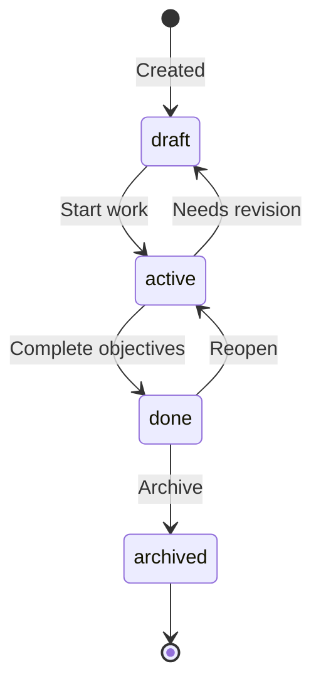
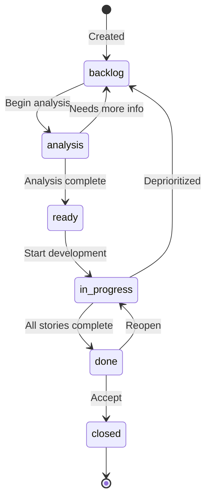
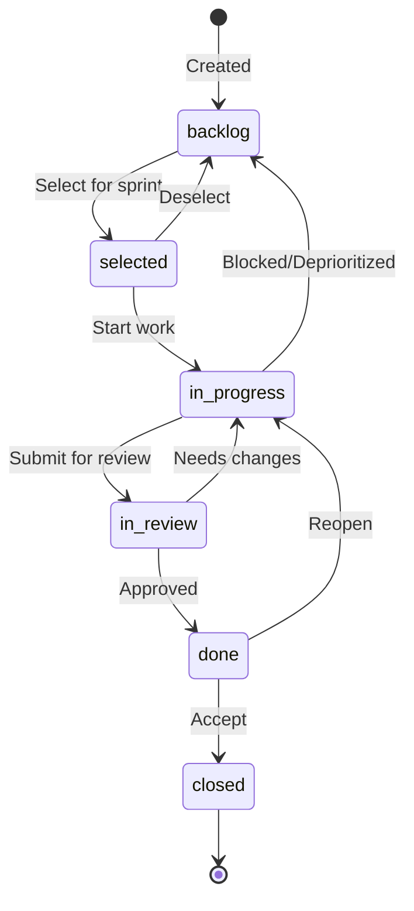
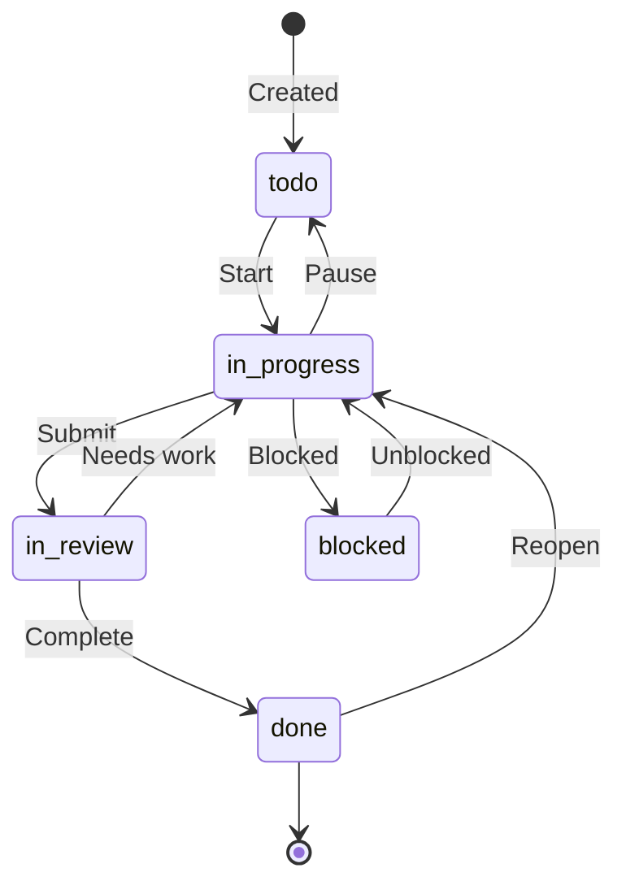
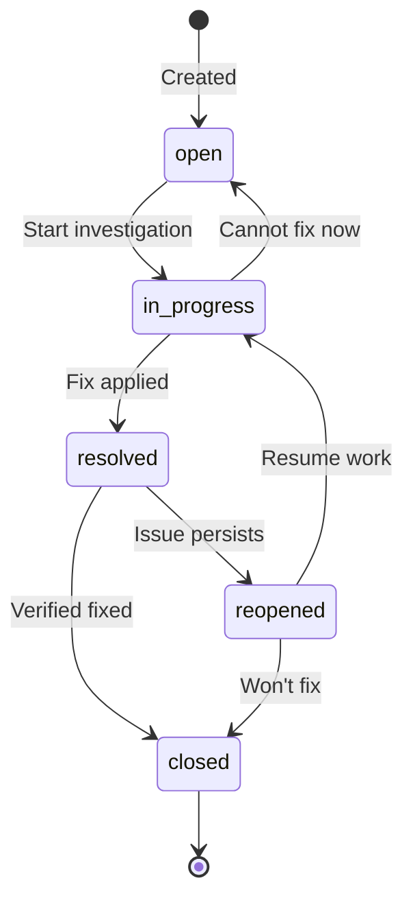
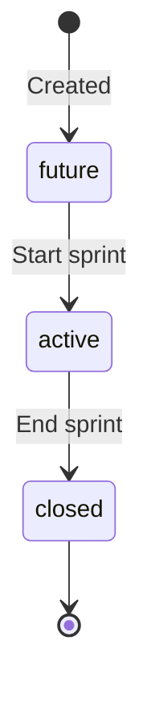
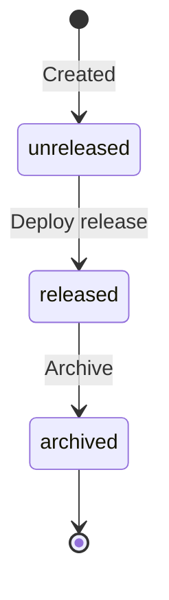

---
metadata:
  status: PRODUCTION
  version: 1.0
  tldr: "Complete workflow state diagrams for all 7 AIGILE entity types with valid transitions"
  author: Vladimir K.S.
  code_refs: [../../src/services/workflow-engine.ts]
---

# Workflow States

## Overview

AIGILE enforces valid status transitions for 7 entity types via the workflow engine. Invalid transitions are rejected with helpful error messages.

---

## Initiative Workflow



### Initiative Transitions

| From | To | Description |
|------|-----|-------------|
| draft | active | Begin initiative |
| active | draft | Return for revision |
| active | done | All epics complete |
| done | active | Reopen initiative |
| done | archived | Archive completed |

---

## Epic Workflow



### Epic Transitions

| From | To | Description |
|------|-----|-------------|
| backlog | analysis | Start requirements |
| analysis | backlog | Return to backlog |
| analysis | ready | Ready for dev |
| ready | in_progress | Development starts |
| in_progress | backlog | Deprioritize |
| in_progress | done | Work complete |
| done | in_progress | Reopen |
| done | closed | Final close |

---

## Story Workflow



### Story Transitions

| From | To | Description |
|------|-----|-------------|
| backlog | selected | Selected for sprint |
| selected | backlog | Removed from sprint |
| selected | in_progress | Work started |
| in_progress | backlog | Returned to backlog |
| in_progress | in_review | Ready for review |
| in_review | in_progress | Changes needed |
| in_review | done | Review passed |
| done | in_progress | Reopen |
| done | closed | Final close |

---

## Task Workflow



### Task Transitions

| From | To | Description |
|------|-----|-------------|
| todo | in_progress | Start work |
| in_progress | todo | Pause work |
| in_progress | in_review | Ready for review |
| in_progress | blocked | Blocked by dependency |
| blocked | in_progress | Blocker removed |
| in_review | in_progress | Changes needed |
| in_review | done | Complete |
| done | in_progress | Reopen |

**Note:** When transitioning to `blocked`, set `blocked_reason` field.

---

## Bug Workflow



### Bug Transitions

| From | To | Description |
|------|-----|-------------|
| open | in_progress | Start investigation |
| in_progress | open | Cannot fix now |
| in_progress | resolved | Fix applied |
| resolved | reopened | Bug reappears |
| resolved | closed | Verified fixed |
| reopened | in_progress | Resume work |
| reopened | closed | Won't fix |

**Resolutions:** Fixed, Won't Fix, Duplicate, Cannot Reproduce, Done

---

## Sprint Workflow



### Sprint Transitions

| From | To | Condition |
|------|-----|-----------|
| future | active | No other active sprint |
| active | closed | Sprint period ends |

**Constraint:** Only ONE sprint can be `active` at a time.

---

## Version Workflow



### Version Transitions

| From | To | Description |
|------|-----|-------------|
| unreleased | released | Release deployed |
| released | archived | Version archived |

---

## Transition Validation

The workflow engine validates all transitions:

```
aigile story transition CCM-5 done
```

**If invalid:**
```
Error: Cannot transition story from 'backlog' to 'done'.
Valid transitions from 'backlog': selected
```

---

## Transition Commands

| Entity | Command |
|--------|---------|
| Initiative | `aigile initiative transition <key> <status>` |
| Epic | `aigile epic transition <key> <status>` |
| Story | `aigile story transition <key> <status>` |
| Task | `aigile task transition <key> <status>` |
| Bug | `aigile bug transition <key> <status>` |
| Sprint | `aigile sprint start <name>` / `close <name>` |
| Version | `aigile version transition <name> <status>` |

---

## Status Summary Table

| Entity | Statuses |
|--------|----------|
| Initiative | draft, active, done, archived |
| Epic | backlog, analysis, ready, in_progress, done, closed |
| Story | backlog, selected, in_progress, in_review, done, closed |
| Task | todo, in_progress, in_review, blocked, done |
| Bug | open, in_progress, resolved, reopened, closed |
| Sprint | future, active, closed |
| Version | unreleased, released, archived |

---

## Cross-References

- [Entity Hierarchy](./entity-hierarchy.md) - Entity relationships
- [Workflows Spec](/.aigile/01_SPECS/aigile/workflows.md) - Full specification
- [CLI Reference](../CLI-REFERENCE.md) - Transition commands
