---
metadata:
  status: PRODUCTION
  version: 1.1
  tldr: "AI agent guide for AIGILE - hour-long sessions, parallel execution, module-first development"
  author: Vladimir K.S.
  primary_audience: AI Agents (Claude Code, etc.)
---

# AI Agent Guide for AIGILE CLI

> **AIGILE ≠ Agile.** Hour-long sprints. Multiple agents in parallel. Module-first build. No estimation - you execute, not estimate.

## Overview

AIGILE is a **hybrid waterfall-agile methodology** optimized for AI agents. This guide covers optimal patterns for AI agents to interact with AIGILE, manage context efficiently, and execute module sprints.

**Key AIGILE Principles:**
- Sprints are hours, not weeks
- Full vision captured upfront (waterfall planning)
- AI agents work in parallel on independent modules
- Module-first build order (foundation → services → integration)
- SDD/BDD/TDD principles enforced

**Read:** [AIGILE Methodology](./AIGILE-METHODOLOGY.md) for complete methodology overview.

### Key Concepts

| Concept | Description |
|---------|-------------|
| Session | Work period tracked with start/end timestamps |
| Context | Project state loaded at session start |
| Entity | Work item (initiative, epic, story, task, bug) |
| Workflow | Valid status transitions per entity type |

---

## Session Lifecycle

AI agents should follow the begin → work → end pattern. **Sessions are typically 30min - 2 hours**, not day-long.

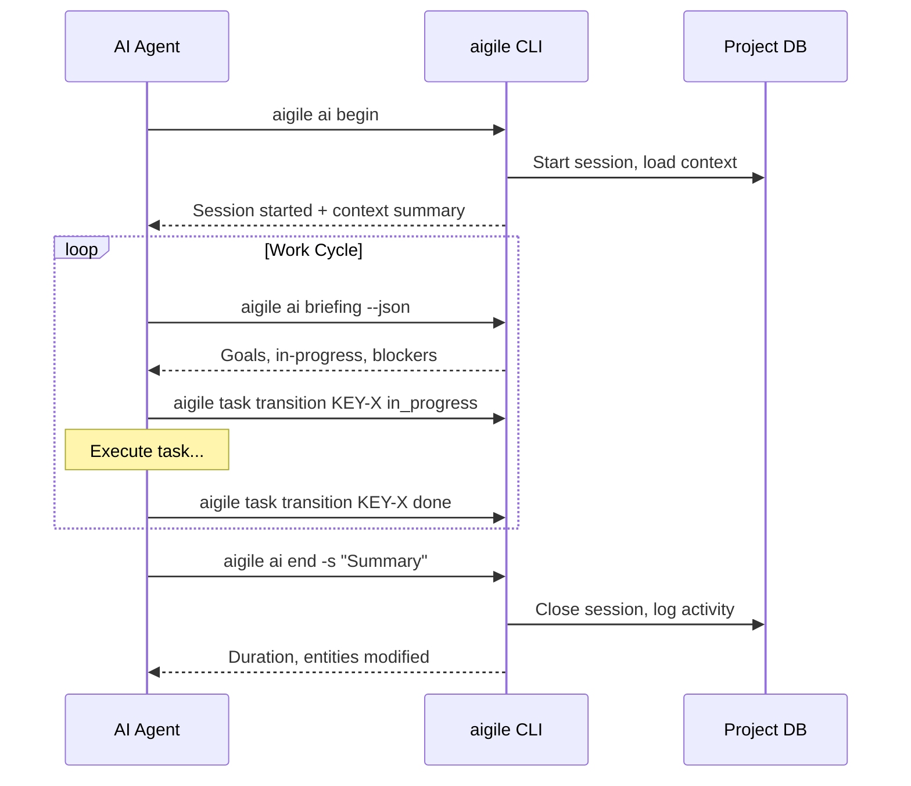

### Session Commands

| Command | Purpose | Output |
|---------|---------|--------|
| `aigile ai begin` | Start work session | Session ID, context |
| `aigile ai briefing` | Get current work context | Goals, blockers, next actions |
| `aigile ai status` | Check session state | Active session info |
| `aigile ai end -s "summary"` | End session with summary | Duration, activity log |
| `aigile ai resume` | Resume previous session | Restored context |

---

## Context Loading

AIGILE provides progressive context loading to optimize token usage.

### Context Levels

| Level | Content | Use Case |
|-------|---------|----------|
| `minimal` | Project info + active session | Quick checks |
| `summary` | + Entity counts + recent activity | Overview |
| `standard` | + Active sprint + in-progress items + blockers | **Default for work** |
| `full` | + All entities + documents + comments | Deep analysis |

### Context Commands

```
aigile context load              # Load standard context
aigile context load --level full # Load full context
aigile context quick             # Load minimal context
aigile context entity KEY-123    # Load specific entity context
aigile context resume            # Load context from last session
```

### Context Output Structure (JSON)

```json
{
  "project": {
    "key": "PROJECT",
    "name": "Project Name",
    "path": "/path/to/project"
  },
  "session": {
    "id": "uuid",
    "started_at": "2025-01-01T09:00:00Z",
    "status": "active"
  },
  "sprint": {
    "name": "Sprint 1",
    "goal": "Complete authentication",
    "days_remaining": 5
  },
  "in_progress": [
    {"key": "KEY-42", "type": "story", "summary": "User login"}
  ],
  "blockers": [],
  "recent_activity": [
    {"action": "transition", "entity": "KEY-41", "to": "done"}
  ]
}
```

---

## Parallel Agent Execution

Multiple AI agents can work simultaneously on independent modules:

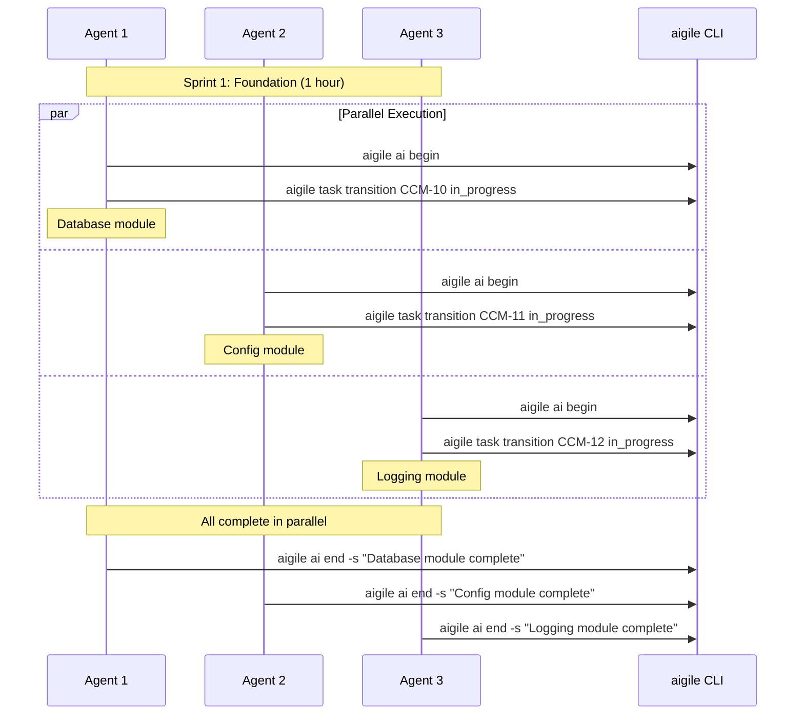

**Parallelization Rules:**
- Agents can work on independent modules simultaneously
- Dependencies must be respected (no parallel work on dependent modules)
- Each agent manages its own session
- Summaries enable handoffs between agents

---

## Work Tracking

### Session Briefing

Start each session with a briefing to understand current state:

```
aigile ai briefing --json
```

Returns:
- Sprint goals and progress
- Items assigned to you (in_progress)
- Blocked items requiring attention
- Suggested next actions

### Activity Logging

All entity changes are automatically logged:

```
aigile session activity           # Current session activity
aigile query recent --limit 10    # Recent changes across sessions
```

### Finding Work

| Command | Purpose |
|---------|---------|
| `aigile query status in_progress` | Find active work |
| `aigile query assignee "AI Agent"` | Find assigned items |
| `aigile sprint board` | View sprint board |
| `aigile ai next` | Get AI-recommended next task |

---

## Entity Workflows

Each entity type has defined status transitions. Invalid transitions are rejected.

### Initiative Workflow

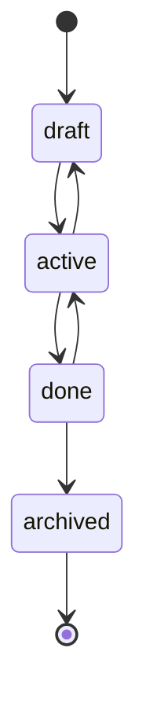

**Valid Transitions:**
- `draft` → `active`
- `active` → `draft`, `done`
- `done` → `active`, `archived`

### Epic Workflow

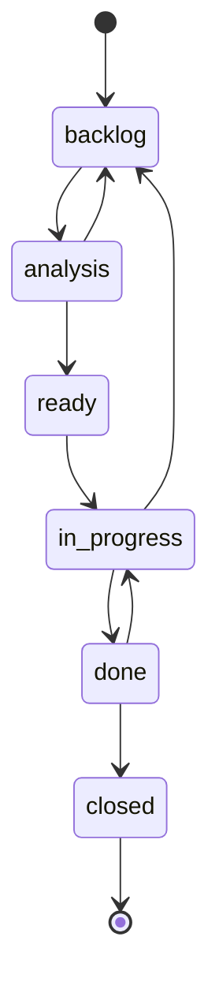

**Valid Transitions:**
- `backlog` → `analysis`
- `analysis` → `backlog`, `ready`
- `ready` → `in_progress`
- `in_progress` → `backlog`, `done`
- `done` → `in_progress`, `closed`

### Story Workflow

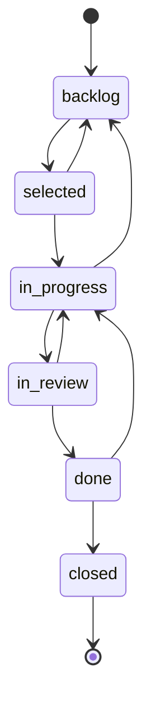

**Valid Transitions:**
- `backlog` → `selected`
- `selected` → `backlog`, `in_progress`
- `in_progress` → `backlog`, `in_review`
- `in_review` → `in_progress`, `done`
- `done` → `in_progress`, `closed`

### Task Workflow

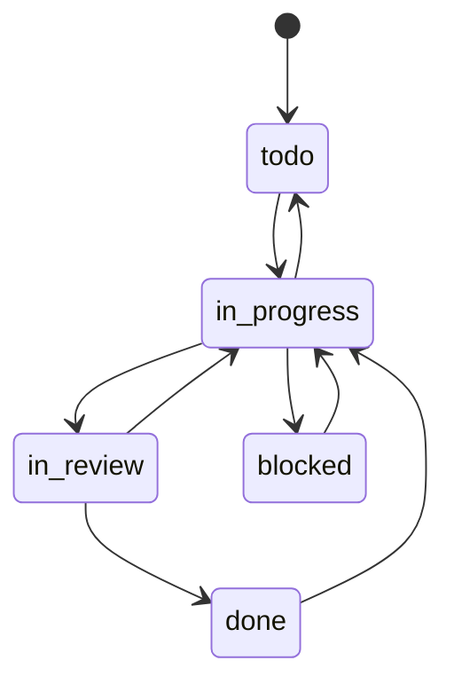

**Valid Transitions:**
- `todo` → `in_progress`
- `in_progress` → `todo`, `in_review`, `blocked`
- `blocked` → `in_progress`
- `in_review` → `in_progress`, `done`
- `done` → `in_progress`

### Bug Workflow

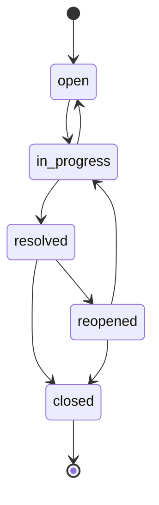

**Valid Transitions:**
- `open` → `in_progress`
- `in_progress` → `open`, `resolved`
- `resolved` → `reopened`, `closed`
- `reopened` → `in_progress`, `closed`

### Sprint Workflow

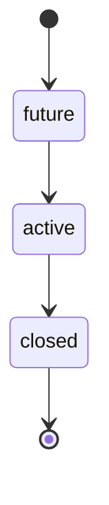

**Constraint:** Only one sprint can be `active` at a time.

### Version Workflow

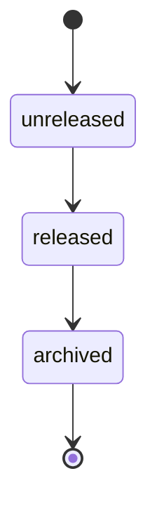

---

## JSON Output Patterns

All commands support `--json` flag for machine-readable output.

### Command Examples

```
aigile story list --json
aigile task show KEY-42 --json
aigile sprint board --json
aigile ai briefing --json
```

### Response Structure

**List Response:**
```json
{
  "success": true,
  "data": [
    {"key": "KEY-1", "summary": "...", "status": "..."},
    {"key": "KEY-2", "summary": "...", "status": "..."}
  ],
  "count": 2
}
```

**Single Entity Response:**
```json
{
  "success": true,
  "data": {
    "key": "KEY-42",
    "summary": "Implement login",
    "status": "in_progress",
    "assignee": "AI Agent",
    "story_points": 5
  }
}
```

**Error Response:**
```json
{
  "success": false,
  "error": {
    "code": "INVALID_TRANSITION",
    "message": "Cannot transition from 'backlog' to 'done'",
    "valid_transitions": ["selected"]
  }
}
```

---

## Best Practices

### 1. Always Start a Session

```
aigile ai begin
```

This ensures:
- Activity is tracked
- Context is loaded
- Session can be resumed if interrupted

### 2. Load Appropriate Context

- Use `standard` level for normal work
- Use `full` only when analyzing entire project
- Use `entity KEY-X` when focusing on specific item

### 3. Check Before Transitioning

Before changing entity status:

```
aigile story show KEY-42 --json
```

Verify current status allows your target transition.

### 4. Use Briefing for Direction

```
aigile ai briefing --json
```

Let AIGILE suggest next actions based on:
- Sprint priorities
- Blocked items
- Incomplete work

### 5. Log Work Summary

Always end sessions with meaningful summaries:

```
aigile ai end -s "Completed KEY-42, KEY-43. Blocked on KEY-44 pending API."
```

### 6. Handle Errors Gracefully

If transition fails:
1. Check current status: `aigile task show KEY-X`
2. Review valid transitions from that status
3. Execute correct transition path

---

## Common Workflows

### Starting New Work

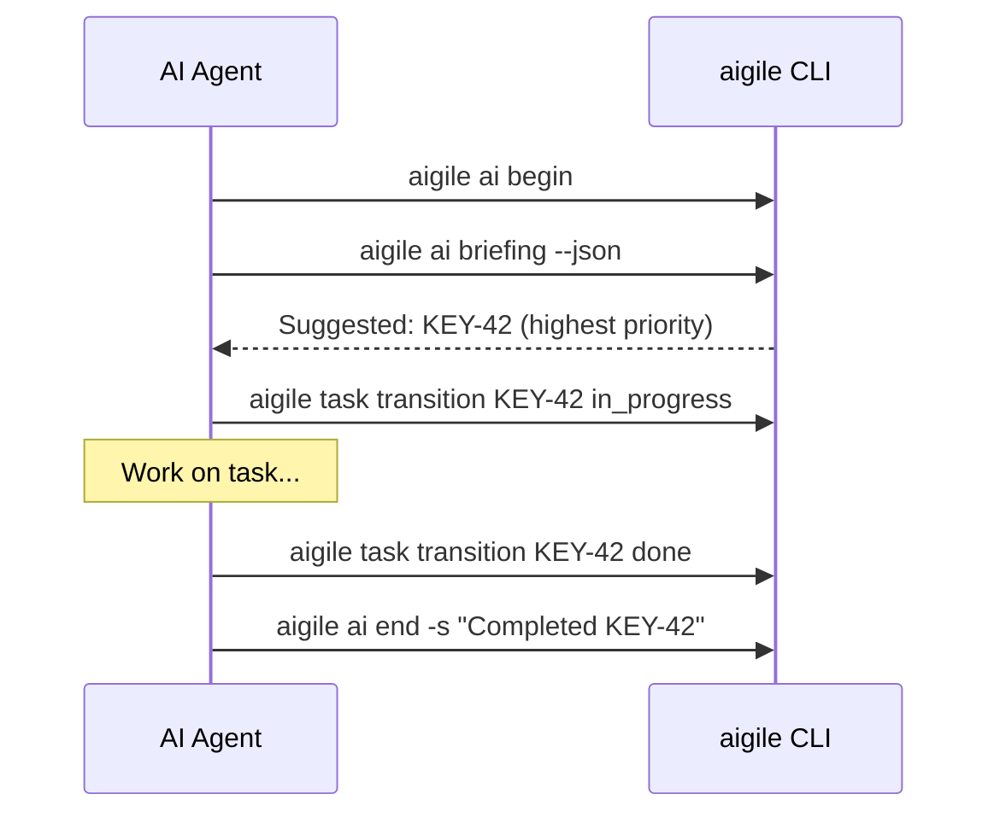

### Handling Blockers

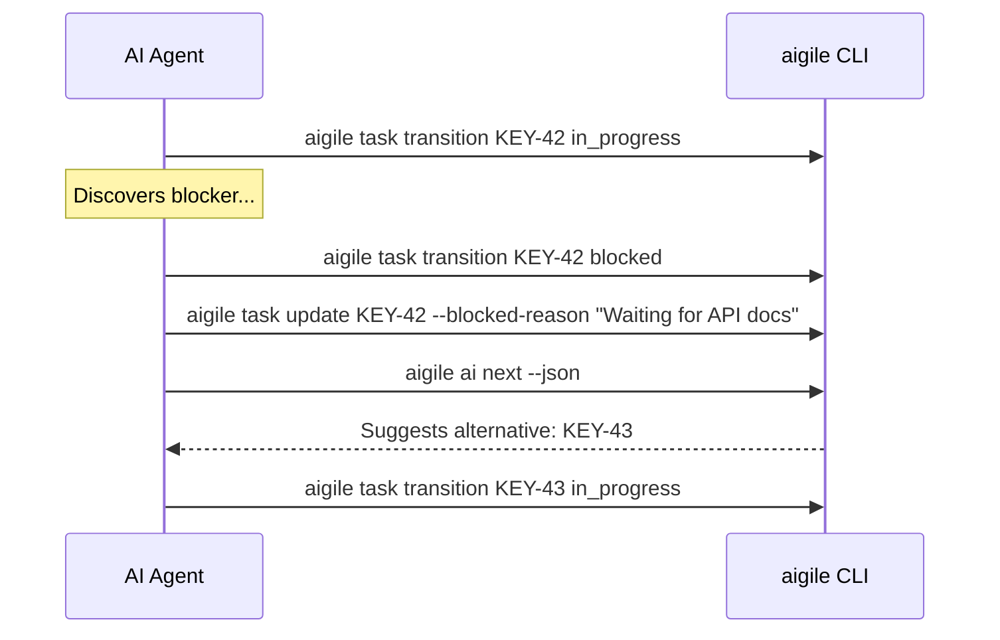

### Bug Triage

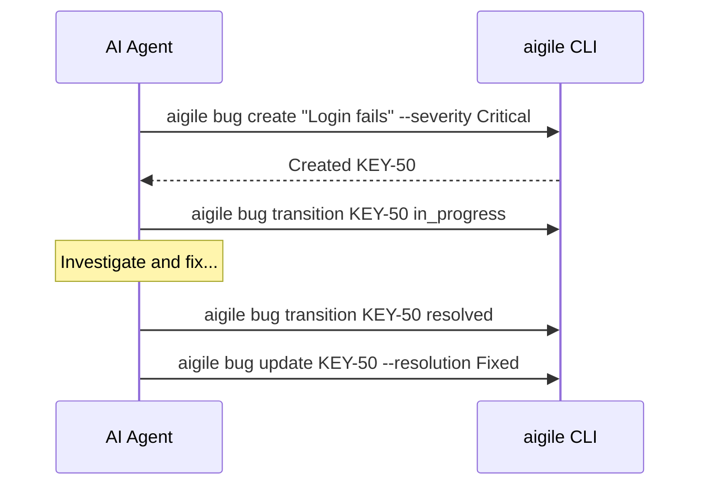

---

## Error Handling

### Invalid Transition

**Error:**
```json
{
  "error": "INVALID_TRANSITION",
  "message": "Cannot transition task from 'todo' to 'done'",
  "valid_transitions": ["in_progress"]
}
```

**Recovery:**
```
aigile task transition KEY-X in_progress
aigile task transition KEY-X in_review
aigile task transition KEY-X done
```

### Entity Not Found

**Error:**
```json
{
  "error": "NOT_FOUND",
  "message": "Entity KEY-999 not found"
}
```

**Recovery:**
```
aigile query search "keyword" --json
```

### No Active Session

**Error:**
```json
{
  "error": "NO_SESSION",
  "message": "No active session. Run 'aigile ai begin' first."
}
```

**Recovery:**
```
aigile ai begin
```

---

## Quick Reference

### Entity Commands

| Entity | Create | List | Transition |
|--------|--------|------|------------|
| Initiative | `aigile initiative create "title"` | `aigile initiative list` | `aigile initiative transition KEY status` |
| Epic | `aigile epic create "title"` | `aigile epic list` | `aigile epic transition KEY status` |
| Story | `aigile story create "title"` | `aigile story list` | `aigile story transition KEY status` |
| Task | `aigile task create "title"` | `aigile task list` | `aigile task transition KEY status` |
| Bug | `aigile bug create "title"` | `aigile bug list` | `aigile bug transition KEY status` |

### AI-Specific Commands

| Command | Purpose |
|---------|---------|
| `aigile ai begin` | Start session |
| `aigile ai end -s "..."` | End session |
| `aigile ai briefing` | Get work context |
| `aigile ai next` | Get next recommended task |
| `aigile ai status` | Check session status |
| `aigile ai resume` | Resume last session |

### Context Commands

| Command | Purpose |
|---------|---------|
| `aigile context load` | Load standard context |
| `aigile context load --level full` | Load full context |
| `aigile context quick` | Load minimal context |
| `aigile context entity KEY` | Load entity-specific context |

---

## Cross-References

- [AIGILE Methodology](./AIGILE-METHODOLOGY.md) - **Understanding AIGILE vs Classical Agile**
- [CLI Reference](./CLI-REFERENCE.md) - Complete command documentation
- [Quick Start](./QUICK-START.md) - 5-minute getting started
- [Workflow States](./05_architecture/workflow-states.md) - All state diagrams
- [Entity Hierarchy](./05_architecture/entity-hierarchy.md) - Entity relationships
- [Journey 04: AI Agent Workflow](./04_ux-journeys/journey-04-ai-daily-workflow.md) - Detailed session workflow
