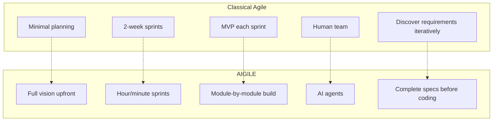
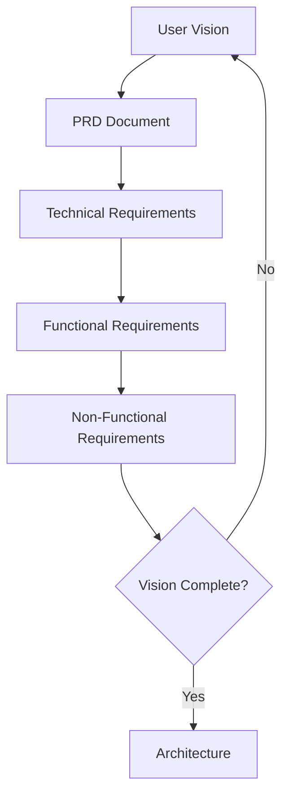
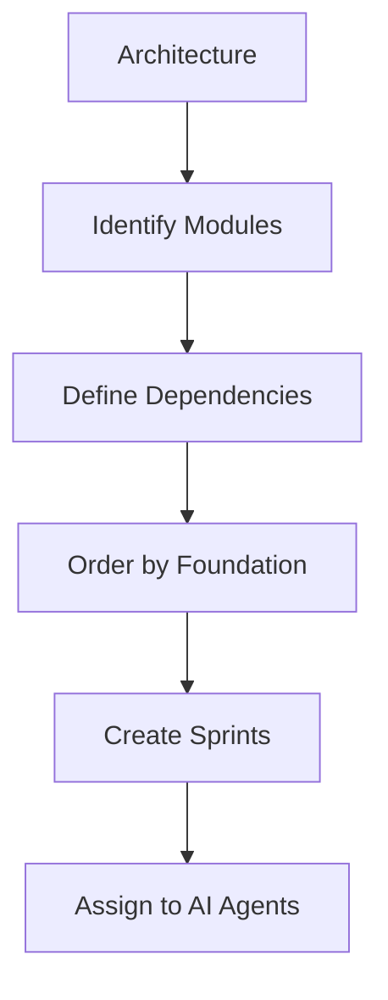
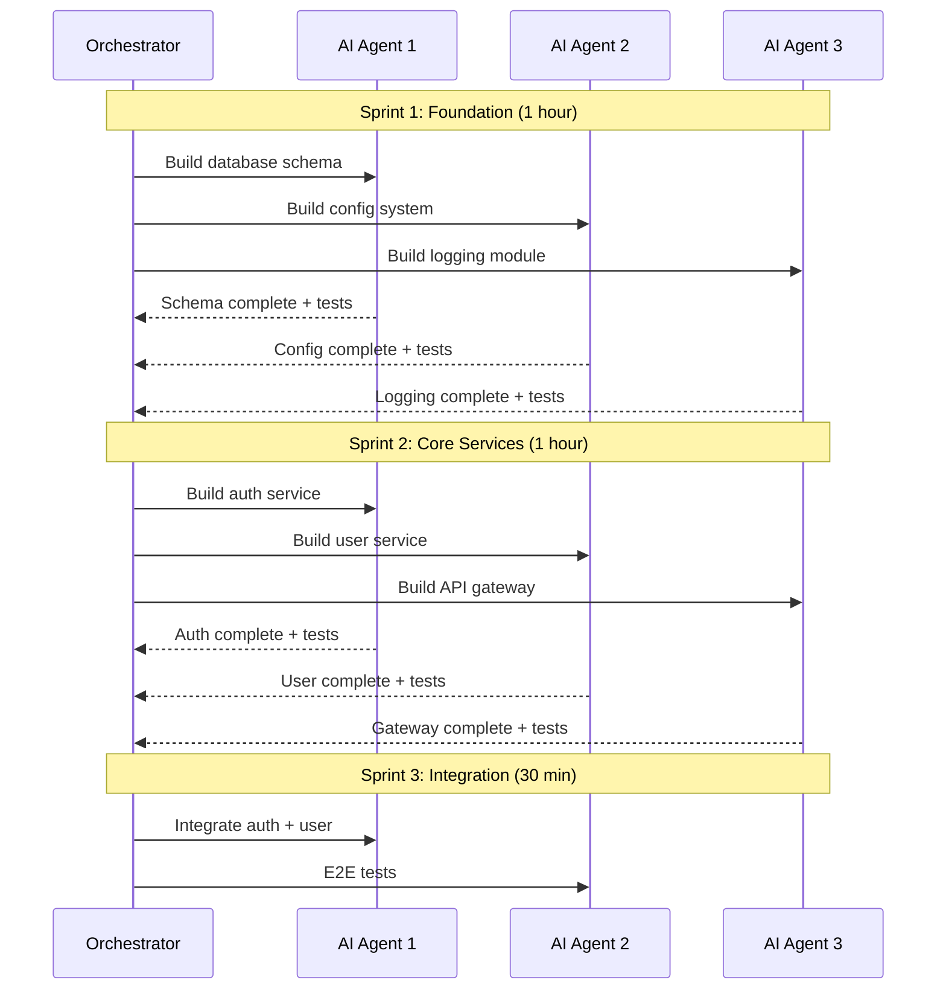
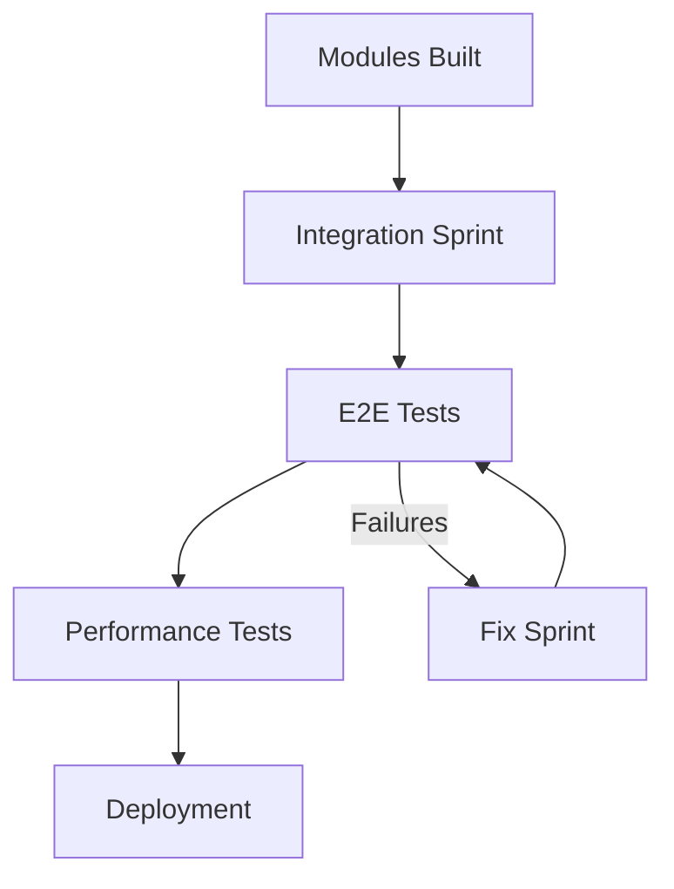
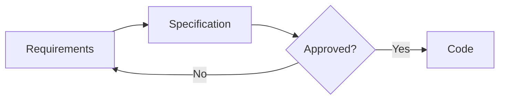
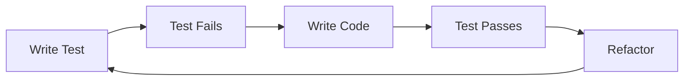
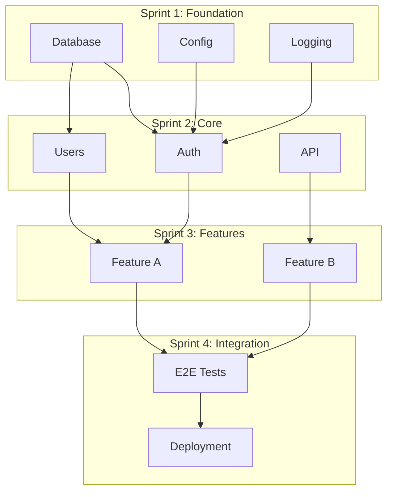

---
metadata:
  status: PRODUCTION
  version: 1.0
  tldr: "AIGILE methodology - AI-first hybrid approach combining waterfall planning with agile execution for AI agents"
  author: Vladimir K.S.
  critical: true
---

# AIGILE Methodology

## Executive Summary

AIGILE is **NOT** traditional Agile. It's a hybrid methodology designed for AI-assisted development where:
- **AI agents** write code, not human teams
- **Sprints** are hours/minutes, not weeks
- **Full vision** is captured upfront (waterfall-style)
- **Modules** are built foundation-up, not MVP-style

---

## Classical Agile vs AIGILE



---

## Key Differences

| Aspect | Classical Agile | AIGILE |
|--------|-----------------|--------|
| **Planning** | Minimal upfront | Full vision captured |
| **Sprint Duration** | 1-2 weeks | Hours or minutes |
| **Team** | Human developers | AI agents |
| **Each Sprint** | Working MVP | Module/component |
| **Requirements** | Discovered iteratively | Spec-driven upfront |
| **Architecture** | Emergent | Designed first |
| **Testing** | Per feature | TDD from start |
| **Parallelism** | Limited by humans | AI agents in parallel |

---

## AIGILE Development Phases

### Phase 1: Vision Capture (Waterfall)

**Goal:** Complete understanding before any code



**Artifacts:**
- Product Requirements Document (PRD)
- Technical specifications
- Quality requirements (scaling, performance)
- User personas and journeys
- BDD feature files (Gherkin)

**AIGILE Commands:**
```
aigile initiative create "Product Vision"
aigile epic create "Feature Area" -i INIT-1
aigile persona create "Target User"
aigile ux-journey create "User Flow"
```

### Phase 2: Architecture Design

**Goal:** Optimal technical foundation before coding

```mermaid
graph TB
    A1[Requirements] --> A2[System Architecture]
    A2 --> A3[Component Design]
    A3 --> A4[Tech Stack Selection]
    A4 --> A5[Module Dependencies]
    A5 --> A6[Integration Plan]

    A6 --> A7{Architecture Validated?}
    A7 -->|No| A2
    A7 -->|Yes| Sprint Planning
```

**Artifacts:**
- System architecture diagrams (C4)
- Component specifications
- API contracts
- Database schemas
- Integration points

### Phase 3: Sprint Planning (Agile Returns)

**Goal:** Plan module-by-module execution



**Sprint Structure:**
- Foundation modules first
- No working MVP requirement
- Parallel agent execution
- Integration sprints planned

**AIGILE Commands:**
```
aigile story create "Module: Database Schema" -e CCM-1 --points 3
aigile story create "Module: Auth Service" -e CCM-1 --points 5
aigile sprint create "Sprint 1: Foundation" --start today --end +2h
aigile sprint add-story "Sprint 1" CCM-5
```

### Phase 4: Sprint Execution

**Goal:** AI agents build modules in parallel



### Phase 5: Integration & Testing

**Goal:** Combine modules into working system



---

## Sprint Types in AIGILE

| Sprint Type | Duration | Purpose |
|-------------|----------|---------|
| Foundation | 1-2 hours | Core infrastructure |
| Module | 30min-1hr | Individual components |
| Integration | 30min-1hr | Combine modules |
| Testing | 30min | E2E validation |
| Fix | 15-30min | Address issues |

---

## Development Principles

### Specification-Driven Development (SDD)

**Never code without approved specifications.**



### Behavior-Driven Development (BDD)

**Define behavior before implementation.**

```gherkin
Feature: User Authentication
  Scenario: Successful login
    Given a registered user exists
    When they submit valid credentials
    Then they receive an auth token
    And are redirected to dashboard
```

### Test-Driven Development (TDD)

**Tests first, then implementation.**



---

## Module-First Architecture

### Build Order



### Not MVP Per Sprint

Classical Agile delivers working software each sprint. AIGILE delivers:

| Sprint | Deliverable |
|--------|-------------|
| 1 | Database schema + migrations + tests |
| 2 | Auth service + tests (no UI) |
| 3 | API endpoints + tests (no frontend) |
| 4 | Frontend components + tests |
| 5 | Integration + E2E tests |
| 6 | **First working system** |

---

## AI Agent Parallelism

### Parallel Execution

```mermaid
gantt
    title Sprint Execution (Parallel AI Agents)
    dateFormat HH:mm
    section Agent 1
    Database Module     :a1, 00:00, 30m
    Auth Integration    :a2, after a1, 20m
    section Agent 2
    Config Module       :b1, 00:00, 20m
    User Service        :b2, after b1, 30m
    section Agent 3
    Logging Module      :c1, 00:00, 15m
    API Gateway         :c2, after c1, 35m
```



### Agent Independence

Each AI agent works independently on:
- Separate modules
- No shared state during sprint
- Own test suite
- Integration at sprint end

---

## AIGILE CLI Workflow

### Phase 1: Vision Capture

```
aigile init
aigile initiative create "Product: My App"
aigile epic create "User Management" -i INIT-1
aigile epic create "Data Processing" -i INIT-1
aigile epic create "Reporting" -i INIT-1
aigile persona create "End User"
aigile ux-journey create "Onboarding"
```

### Phase 2: Story Definition

```
aigile story create "Database schema design" -e CCM-1 --points 3
aigile story create "Auth service implementation" -e CCM-1 --points 5
aigile story create "User service implementation" -e CCM-1 --points 5
aigile story create "API gateway setup" -e CCM-1 --points 3
```

### Phase 3: Sprint Planning

```
aigile sprint create "Sprint 1: Foundation" --start now --end +2h -g "Core infrastructure"
aigile sprint add-story "Sprint 1" CCM-5
aigile sprint add-story "Sprint 1" CCM-6

aigile sprint create "Sprint 2: Services" --start +2h --end +4h -g "Core services"
aigile sprint add-story "Sprint 2" CCM-7
aigile sprint add-story "Sprint 2" CCM-8
```

### Phase 4: Execution

```
aigile sprint start "Sprint 1"
aigile ai begin
aigile task transition CCM-10 in_progress
# ... AI agent implements ...
aigile task transition CCM-10 done
aigile ai end -s "Database module complete with tests"
```

---

## Success Criteria

### Vision Phase
- [ ] Complete PRD document
- [ ] All epics defined
- [ ] Personas created
- [ ] UX journeys mapped
- [ ] BDD features written

### Architecture Phase
- [ ] System architecture documented
- [ ] Tech stack selected
- [ ] Module dependencies mapped
- [ ] API contracts defined
- [ ] Database schema designed

### Execution Phase
- [ ] Modules built with tests
- [ ] All tests passing
- [ ] Integration complete
- [ ] E2E tests passing
- [ ] System deployed

---

## Cross-References

- [AI Agent Guide](./AI-AGENT-GUIDE.md) - Agent workflow
- [Sprint Planning Journey](./04_ux-journeys/journey-03-sprint-planning.md) - Sprint workflow
- [Entity Hierarchy](./05_architecture/entity-hierarchy.md) - Work item structure
